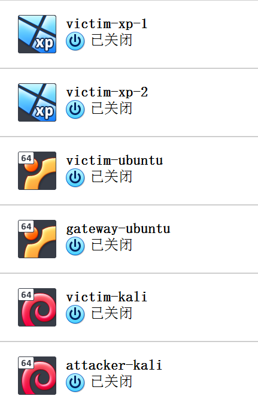
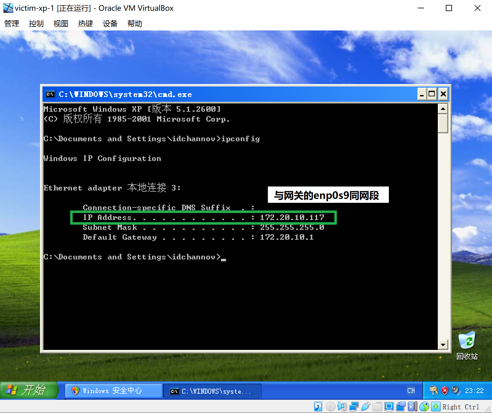
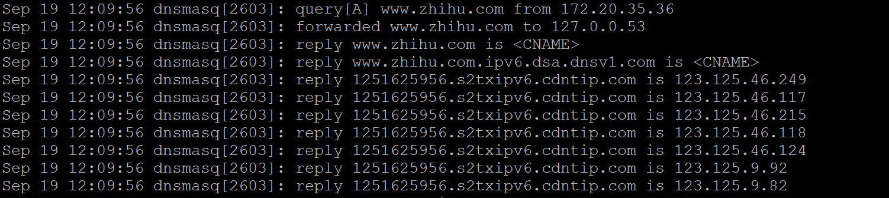

# Exp-01  基于 VirtualBox 的网络攻防基础环境搭建

### 1. 实验目的

- [x] 掌握 VirtualBox 虚拟机的安装与使用
- [x] 掌握 VirtualBox 的虚拟网络类型和按需配置
- [x] 掌握 VirtualBox 的虚拟硬盘多重加载

### 2. 实验要求

- [x] 虚拟硬盘配置成多重加载

- [x] 搭建满足如下拓扑图所示的虚拟机网络拓扑

  

- [x] 完成以下网络连通性测试

  - 靶机可以直接访问攻击者主机

  - 攻击者主机无法直接访问靶机

  - 网关可以直接访问攻击者主机和靶机

  - 靶机的所有对外上下行流量必须经过网关

  - 所有节点均可以访问互联网

### 2. 实验环境

- 网络拓扑

  

- 节点信息描述：网关（Ubuntu x1），靶机（XP x2 / Kali x1/ Ubuntu x1），攻击者主机（Kali x1）

  |   虚拟机名称   |      网卡选择      |                       IP地址                        |
| :------------: | :----------------: | :-------------------------------------------------: |
  |  victim-xp-1   | 内部网络，intnet-1 | 172.20.10.117, within [172.20.10.10,172.20.10.150]  |
  |  victim-xp-2   | 内部网络，intnet-2 | 172.20.35.36, within [172.20.35.10, 172.20.35.150]  |
  | gateway-ubuntu |  NAT网络，ID-net   |                     10.0.2.4/24                     |
  |                |   Host-Only网络    |                  192.168.56.106/24                  |
  |                | 内部网络，intnet-1 |                  172.20.10.1.1/24                   |
  |                | 内部网络，intnet2  |                   172.20.35.1/24                    |
  | victim-ubuntu  | 内部网络，intnet-2 | 172.20.35.144, within [172.20.35.10, 172.20.35.150] |
  | attacker-kali  |  NAT网络，ID-net   |                    10.0.2.15/24                     |
  |  victim-kali   | 内部网络，intnet-1 | 172.20.10.133, within [172.20.10.10, 172.20.10.150] |

### 4. 实验过程

- 准备工作：下载系统映像

  

- 虚拟机配置

  - 系统安装

    - 创建初始Windows-XP x1，Kali x1，Ubuntu x1

      

    - 在虚拟介质管理中释放虚拟硬盘后，将系统映像改为多重加载

      

      

      

    - 使用多重加载的系统映像创建所需实验机

      
  
- 网络配置

  - 网络类型选择

    1. ID-net    Nat网络

       *（注：于**管理-全局设定-网络**中添加）

         

    2. intnet1、intnet2    内网

    3. 网络地址转换

  - 网卡设置

    1. gateway-ubuntu	四块网卡（ID-net，NAT，intnet1，intnet2）

       - ID-net、NAT    IP地址为dhcp自动分配
       
       - intnet1、intnet2    手动分配IP地址
       
       - 设置防火墙过滤规则
         1. 内网流量经过enp0s3
         2. 内网间不互通
       
       - 配置DHCP服务，为内网动态分配IP与提供路由
       
         ```cmd
         # 编辑网络配置文件
         vim /etc/netplan/01-netcfg.yml
         # 使用测试命令看配置是否成功
         netplan try
         # 若成功则应用新配置
         netplan apply
         # 配置防火墙过滤规则
         iptables -t nat -A POSTROUTING -s 172.20.10.0/24 -o enp0s3 -j MASQUERADE
         iptables -t nat -A POSTROUTING -s 172.20.35.0/24 -o enp0s3 -j MASQUERADE
         iptables -t nat -A POSTROUTING -s 172.20.10.0/24 ! -d 172.20.0.0/16 -o enp0s3 -j MASQUERADE
         iptables -t nat -A POSTROUTING -s 172.20.35.0/24 ! -d 172.20.0.0/16 -o enp0s3 -j MASQUERADE
         iptables -P FORWARD DROP
         iptables -A FORWARD -m state --state RELATED,ESTABLISHED -j ACCEPT
         iptables -A FORWARD -s '172.20.10.0/24' ! -d '172.20.0.0/16' -j ACCEPT
         iptables -A FORWARD -s '172.20.35.0/24' ! -d '172.20.0.0/16' -j ACCEPT
         iptables -I INPUT -s 172.20.10.0/24 -d 172.20.35.0/24 -j DROP
         iptables -I INPUT -s 172.20.35.0/24 -d 172.20.10.0/24 -j DROP
         # 保存当前防火墙过滤规则到文件，便于后续使用
         iptables-save > /etc/iptables.rule
         # 防火墙规则应用（重新启动时）
         iptables-restore < /etc/iptables.rule
         # 开启数据转发功能，取消net.ipv4.ip_forward=1的注释
         vim /etc/sysctl.conf
         # 使数据转发功能生效（永久）
         sysctl -p
         # 编辑网关DHCP服务的配置文件
         # *（注：此处使用dnsmasq）
         vim /etc/dnsmasq.d/gateway-enp0s9.conf
         vim /etc/dnsmasq.d/gateway-enp0s10.conf
         # 备份主配置文件/etc/dnmasq.conf
         cp -r /etc/dnsmasq.conf /etc/dnsmasq.conf.bak
         # 编辑主配置文件/etc/dnsmasq.conf
         vim /etc/dnsmasq.conf
         # 重启dnsmasq服务，使配置生效
         systemctl restart dnsmasq
         # 设置dnsmasq开机自启动
         systemctl enable dnsmasq
         ```
       
         **/etc/netplan/01-netcfg.yml**
       
         ```
         network:
           version: 2
           renderer: networkd
           ethernets:
             enp0s3:
               # 动态
               dhcp4: yes
             enp0s8:
               # 静态
               dhcp4: yes
               dhcp-identifier: mac
             enp0s9:
               # 静态
               addresses: [inet1_addr/mask]
             enp0s10:
               # 静态
               addresses: [inet2_addr/mask]
         ```
       
         **/etc/dnsmasq.d/gateway-enp0s9.conf**
         
         ```
         interface=enp0s9
         dhcp-range=172.20.10.10,172.20.10.150,24h
         ```
         
         **/etc/dnsmasq.d/gateway-enp0s9.conf**
         
         ```
         interface=enp0s10
         dhcp-range=172.20.35.10,172.20.35.150,24h
         ```
         
         **/etc/dnsmasq.conf**
         
         ```
         # add
         log-queries
         log-facility=/var/log/dnsmasq.log
         log-dhcp
         ```
       
       
       
       
  
  2. victim-ubuntu    一块网卡（intnet2）
  
     - 启用网卡enp0s3，IP地址从gateway-ubuntu自动获取
     
     
  
  3. victim-xp-1    一块网卡（intnet1）
  
     - IP地址从gateway-ubuntu自动获取
     
         
    
  4. victim-xp-2    一块网卡（intnet2）
     
     - IP地址从gateway-ubuntu自动获取
       
         
     
  5. victim-kali    一块网卡（intnet1）
     
     - 启用网卡eth0，IP地址从gateway-ubuntu自动获取
     
       ```cmd
       root@id-srv:/home/idchannov#  vim /etc/network/interfaces
       # 网络接口配置
       source /etc/network/interfaces.d/*
                
       auto lo
       iface lo inet loopback
       # add
       auto eth0
       iface eth0 inet dhcp
       ```
     
       
  
  6. attacker-kali    一块网卡（ID-net）
  
     - IP地址自动分配
       
       
  
    - 连通性测试
  
    1. 靶机可以直接访问攻击者主机
  
       - intnet1
  
         
  
         
  
       - intnet2
  
         
         
           
  
      2. 攻击者主机无法直接访问靶机
  
       
  
    3. 网关可以直接访问攻击者主机和靶机
  
       
  
    4. 靶机的所有对外上下行流量必须经过网关
  
       ```cmd
         
         ```
       # 查看dns服务日志
     root@id-srv:/home/idchannov# tail -F /var/log/dnsmasq.log
         ```
  
       - victim-widows-xp-1
  
         
  
       - victim-widows-xp-1
  
         
  
       - victim-kali
  
         
  
       - victim-ubuntu
  
         
  
    5. 所有节点均可以访问互联网
  
       - gateway-ubuntu
  
         
  
       - attacker-kali
  
         
  
       - victim-windows-xp-1
  
         
  
       - victim-windows-xp-2
  
         
  
       - victim-kali
  
         
  
       - victim-ubuntu
      
           
         ```

### 5. 遇到的问题

- kali在虚拟机上安装失败

  
  
  **出错原因：**设置磁盘分区时分配的存储空间不够
  
  （注：若手动安装的话**最好**使用文本界面）
  
  **解决方法【可选】：**
  
  - 下载官网的 Virtualbox - kali镜像直接使用，ova的**默认用户名和口令**都是 kali
  - 增加虚拟硬盘的大小，减少安装的软件
  - 拷贝已配置好的虚拟机
  
  **结果展示：**
  
  
  
- 在kali环境下使用`ifconfig`提示`command not found`

  **解决方法：**加入/sbin到系统环境变量

  ```cmd
  export PATH=$PATH:/sbin
  ```

- 网络连接失败，靶机无法ping通攻击者主机
  
  **解决方法：**
  
  - 网关上需配置dnsmasq，使得网关为局域网内的虚拟机动态分配IP与提供路由
  
  - 除网关IP为静态手动配置以外，其余虚拟机的IP均为网关动态分配
  
  - 开启防火墙，将网关防火墙规则写入配置文件
  
    - 防火墙规则需设置为开机自动生效
  
    - 若不设置转发规则，gateway则无法连接不同网段，网络一定不通
    - 注意检查防火墙设置的规则
  
  - 检查网关dnsmasq服务是否正常启动
  
- windows-xp靶机无法联网

  **出错原因：**VirtualBox将windows-xp虚拟机的控制芯片默认设置为`Inter PRO/1000 MT桌面（82540EM）`，但windows-xp的网卡驱动不支持此选项导致虚拟机缺少网卡

  **解决方法：**将虚拟机的控制芯片改为`PCnet-FAST III (Am79C973)`

- windows-xp与网关无法联通

  **出错原因：**windows-xp存在防火墙

  **解决方法：**

  - 关闭windows-xp防火墙
  - 为防火墙过滤规则添加例外

### 6. 参考资料

- [VirtualBox安装Windows XP](https://blog.csdn.net/q1302182594/article/details/8720545)
- [How to install Kali Linux 2020.2 in VirtualBox 6](https://www.shaileshjha.com/how-to-install-kali-linux-2017-in-virtualbox/)
- [VirtualBox虚拟机网络设置（四种方式）](https://www.cnblogs.com/qianjinyan/p/8661668.html)
- [Ubuntu18.04下双网卡内外网设置](https://blog.csdn.net/tjsxin/article/details/94390346)
- [dnsmasq official](https://wiki.debian.org/dnsmasq?action=show&redirect=HowTo%2Fdnsmasq)
- [UBUNTU 18.04 搭建IPTABLES防火墙](https://www.todocker.cn/2235.html)
- [【solved】在ubuntu下iptables规则设置后重启失效](http://blog.sina.com.cn/s/blog_4a2ee3fb0102wqfq.html)

