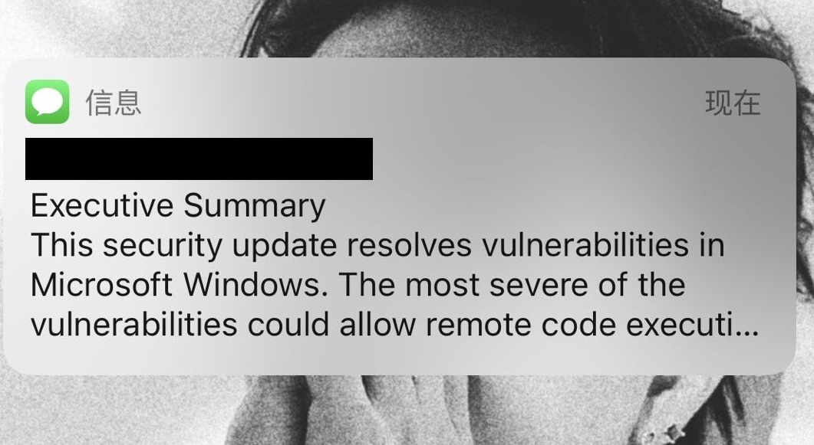
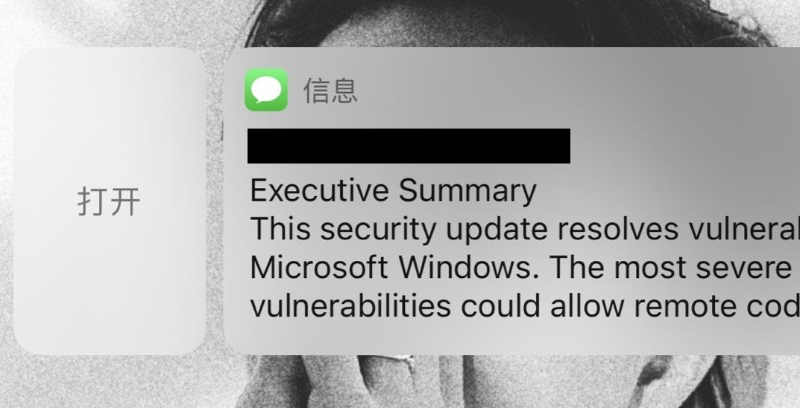

# Exp-02 操作系统的访问控制设计实例研究

### 1. 实验要求

- [x] 请准确记录、描述你的实验运行环境信息，包括但不限于：操作系统版本（如果是第三方应用，请给出精确版本号）、硬件设备型号、是否默认设置
- [x] 请综合运用访问控制模型、威胁建模、安全假设和信任等专业知识和语言论证实验中给出的安全问题

### 2. 实验环境

- 操作系统：IOS 14.0
- 设备型号：iPhone X (MQA92CH/A)

- 运营商：中国联通 42.1
- 是否应用默认设置：是

### 3. 访问控制设计实例

- 当系统处于锁屏状态下接收到新短信时，不解锁情况下

  - 系统是否允许查看短信内容？

    **【ANS】** 可完全显示在锁屏显示框内的短信内容可以完整查看，长短信需要解锁手机后才能查看

    - 长信息

      

      

    - 短信息

      

  - 系统是否允许回复短信？

    **【ANS】** 允许，长按信息框即可回复

    

- 当系统处于锁屏状态下，使用系统内置（例如 iOS 的 Siri ）或第三方的语音助手可以完成以下哪些操作？

  - [ ] 访问通讯录
  - [x] 拨打电话
  - [ ] 访问相册
  - [ ] 查看短信收件箱

### 4. 思考题

- 以上设计实现方式属于我们课堂上讲过的哪种强制访问控制模型？Lattice/BLP？Biba？

  **【ANS】** Lattice/BLP (下读上写)

- 系统或第三方应用程序是否提供了上述功能的访问控制规则修改？如果修改默认配置，是提高了安全性还是降低了安全性？

  - 是；给用户提管理员权限即可：

    > 管理员可以安装配置描述文件来限制设备功能。以下访问限制可供使用：
    >
    >   1.  允许应用程序安装
    >   2. 允许使用相机
    >   3. 允许 FaceTime
    >   4. 允许屏幕快照
    >   5. 允许语音拨号
    >   6. 允许在漫游时自动同步
    >   7. 允许应用程序内购买项目
    >   8. 允许同步最近的“邮件”信息
    >   9. 强制用户为所有购买输入商店密码
    >   10. 允许多人游戏
    >   11. 允许添加 Game Center 朋友
    >   12. 允许使用 Siri
    >   13. 设备锁定时允许使用 Siri
    >   14.  设备锁定时允许 Passbook 通知
    >   15. 允许未被管理的目的位置中包含来自被管理的来源中的文稿
    >   16. 允许被管理的目的位置中包含来自未被管理的来源中的文稿
    >   17. 允许 iCloud 钥匙串
    >   18. 允许以无线方式更新证书信任数据库
    >   19. 允许在锁定屏幕上显示通知
    >   20. 强制 AirPlay 连接使用配对密码
    >   21. 允许 Spotlight 显示用户通过互联网生成的内容
    >   22. 允许使用 Handoff
    >   23. 允许备份企业级图书
    >   24. 允许在用户的设备间同步企业级图书中的笔记和书签
    >   25. 限制应用程序评级
    >   26. 允许使用 Safari 
    >   27. 启用 Safari 自动填充
    >   28. 启用 JavaScript
    >   29. 限制 Safari 中广告跟踪
    >   30. 阻止弹出式窗口
    >   31. 接受 Cookie
    >   32. 允许 iCloud 云备份
    >   33. 允许 iCloud 文稿和键值同步
    >   34. 允许 iCloud 照片图库
    >   35. 允许 iCloud 照片共享
    >   36. 允许照片流
    >   37. 允许共享的照片流
    >   38. 允许将诊断信息发送给 Apple
    >   39. 允许用户接受不被信任的 TLS 证书
    >   40. 强制执行加密备份
    >   41. 通过内容评级限制媒体
    >   42. 允许 Touch ID
    >   43. 允许在锁定屏幕使用控制中心
    >   44. 允许在锁定屏幕上显示“今天”视图
    >   45. 要求 Apple Watch 进行手腕检测

  - 若修改不当则会降低安全性，一般来说保持默认设置是最保险的做法

### 5. 参考资料

- [iOS 安全保护—白皮书 | 2015 年 6 月](https://www.apple.com.cn/privacy/docs/iOS_Security_Guide.pdf)
