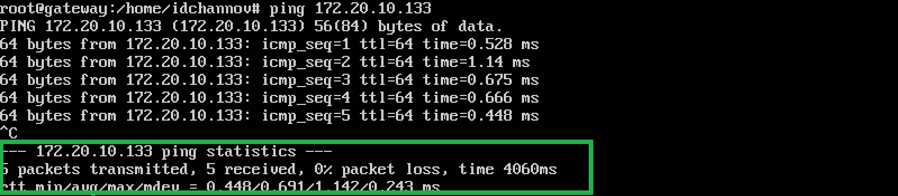

# Exp-03 HTTP正向代理服务器实验

### 1. 实验要求

- [x] 在网关中安装tinyproxy，然后用主机设置浏览器代理指向tinyproxy建立的HTTP正向代理
- [x] 在Kali中用wireshark抓包，分析抓包过程，理解HTTP正向代理HTTPS流量的特点

### 2. 实验环境

- 网络拓扑

  

- 节点信息描述

  |   虚拟机名称    |      网卡选择      |      IP地址       |
  | :-------------: | :----------------: | :---------------: |
  | gateway-ubuntu  |  NAT网络，ID-net   |    10.0.2.4/24    |
  |                 |   Host-Only网络    | 192.168.56.106/24 |
  |                 | 内部网络，intnet-1 |  172.20.10.1/24   |
  |   victim-xp-1   | 内部网络，intnet-1 |  172.20.10.30/24  |
  |   victim-kali   | 内部网络，intnet-1 | 172.20.10.133/24  |
  | attacker-intnet |  NAT网络，ID-net   |   10.0.2.15/24    |

- 网络连通性

  - 靶机可以直接访问攻击者主机

    - victim-kali

      

    - victim-xp-1

      

  - 攻击者主机无法直接访问靶机

    - victim-kali

      

    - victim-xp-1

      

  - 网关可以直接访问攻击者主机和靶机

    - attacker-kali

      

    - victim-kali

      

    - victim-xp-1

      

  - 靶机的所有对外上下行流量必须经过网关

    查看网关的DNS服务日志如下：

    - victim-kali

      

    - victim-xp-1

      


  - 所有节点均可以访问互联网

    - gateway-ubuntu

      

    - attacker-kali

      

    - victim-kali

      

    - victim-xp-1

      

- 软件环境

  - tinyproxy - 1.8.4

  - wireshark - 3.2.5

### 3. 正向代理机制模拟

- 网关：代理服务器

- 靶机：服务器

- 攻击者主机：客户端

### 4. 实验过程

- 网关

  ```cmd
  apt-get update & apt-get install tinyproxy
  # 备份tinyproxy配置文件
  cp /etc/tinyproxy/tinyproxy.conf /etc/tinyproxy/tinyproxy.conf.bak
  # 编辑tinyproxy配置文件
  vim /etc/tinyproxy/tinyproxy.conf
  # 开启tinyproxy服务
  systemctl start tinyproxy
  ```

  **/etc/tinyproxy/tinyproxy.conf**

  ```cmd
  # 取消行首注释，旨在允许NAT网络内的节点使用网关的代理服务
  Allow 10.0.0.0/8
  ```

- 攻击者主机：
  
  - 在浏览器中配置代理服务，此处的端口应与 **/etc/tinyproxy/tinyproxy.conf** 中保持一致
    

    - 访问victim-kali

      

    - 访问HTTPS站点

      

### 5. 抓包与分析

- 正向代理功能验证

  - 靶机（服务器）行为分析：
  
    - HTTP协议中添加了Via字段，说明网关（代理服务器）正在提供代理服务

    - 攻击者主机（客户端）IP地址、以太网接口均未暴露

      

  - 网关（代理服务器）行为分析：

    - 网关保留HTTP GET请求内容，若攻击者主机（客户端）的浏览器不清除历史记录，则下次访问同样的HTTP服务时用时非常短

    - 若在网关设置防火墙规则过滤攻击者主机（客户端）发出的的请求，则攻击者主机（客户端）依然无法访问靶机端（服务器）的HTTP服务

    - 代理层可以理解HTTP报文

      

      
  
  由此，正向代理机制的以下功能得到验证：

  - [x] 访问原来无法访问的资源

  - [x] 做缓存，加速访问资源

  - [x] 对客户端访问授权，上网进行认证

  - [x] 记录用户访问记录，对外隐藏用户信息

- HTTP正向代理HTTPS流量特点

  [【CLICK TO VIEW FULL GATEWAY-PCAP】](elem/gateway-pcap.txt)

  - 代理服务器不知道客户端和服务器的HTTPS通信内容(HTTP报文经过加密)，但代理服务器知道客户端访问了哪个HTTPS站点

  - 只有HTTP报文被加密了，TCP/IP报文依然是明文的

    - 网关（代理服务器）

      

    - 攻击者主机（客户端）

      

### 6. 遇到的问题

- **【Unsolved】** 在网关配置完成并开启tinyproxy、靶机开启apache2服务后，攻击者主机依然无法访问靶机的HTTP服务站点

  **个人推测：** 可能与攻击者主机浏览器清除所有历史记录有关，之后攻击者主机又遇到了DNS域名无法正常解析的问题，此时`/etc/resolv.conf`中的内容只有Windows主机的IP地址（与虚拟机刚建立时一样），重启虚拟机后错误依然得不到解决，但第二天打开主机和虚拟机后问题就莫名其妙的解决了

### 7. 参考资料

- [tshark - The Wireshark Network Analyzer 3.2.7](https://www.wireshark.org/docs/man-pages/tshark.html)

- [CUCCS/2019-NS-Public-chencwx](https://github.com/CUCCS/2019-NS-Public-chencwx/blob/ns_chap0x03/ns_chapter3/HTTP%E4%BB%A3%E7%90%86%E6%9C%8D%E5%8A%A1%E5%99%A8%E5%AE%9E%E9%AA%8C.md)