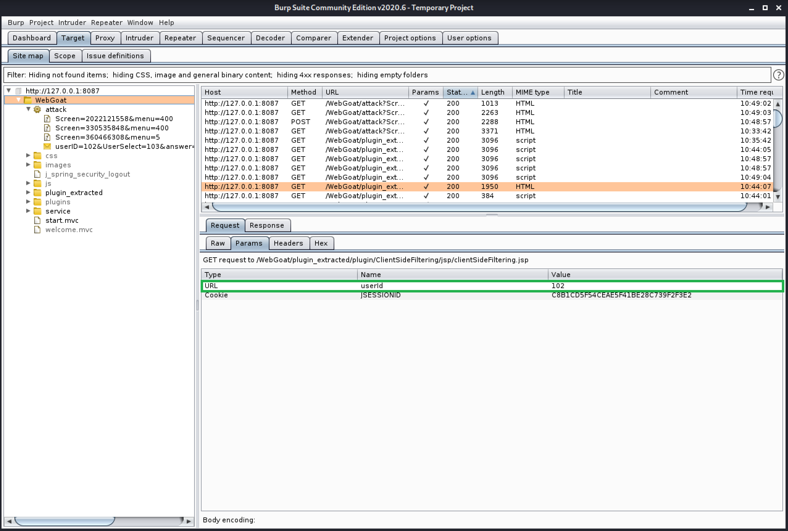
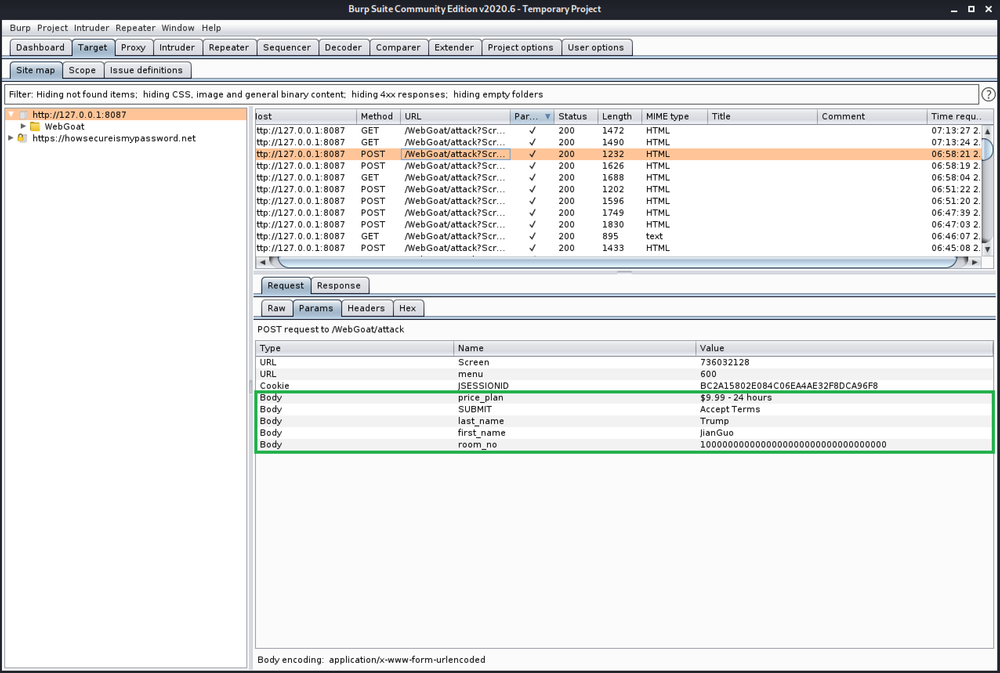

# Exp-07.1 基于WebGoat的漏洞利用

### 1. 实验目的

- [x] 了解常见 Web 漏洞训练平台

- [x] 了解常见 Web 漏洞的基本原理；

- [x] 掌握 OWASP Top 10 及常见 Web 高危漏洞的漏洞检测、漏洞利用和漏洞修复方法

### 2. 实验要求

- [x] 完成不少于 5 种不同漏洞类型的漏洞利用练习

- [x] （可选）使用不同于官方教程中的漏洞利用方法完成目标漏洞利用练习

    *（注：参考Solution的题解已在实验报告中注明）

- [x] （可选）定位缺陷代码

- [x] （可选）尝试从源代码层面修复漏洞

### 3. 实验环境

- docker.io 19.03.13+dfsg1-2

- WebGoat-7.0.1

### 4. 实验完成度

- **Access Control Flaws**

    

- **AJAX Security**

    

- **Authentication Flaws**

    

- **Buffer Overflows**

    

- **Code Quality**

    

- **Concurrency**

    

- **Improper Error Handling**

    

- **Insecure Communication**

    

- **Insecure Storage**

    

- **Parameter Tampering**

    

- **Session Management Flaws**

    


### 5. 实验准备

- WebGoat漏洞攻防训练环境搭建

    ```cmd
    # 安装docker与docker-compose
    apt-get update && apt get install docker.io python3-pip 
    pip3 install docker-compose
    # 在用户目录/home/user_name下新建工作目录
    mkdir workspace
    # 开启docker服务
    systemctl start docker
    # 切换至工作目录
    cd workspace/
    # 下载课程所需漏洞练习环境
    git clone https://github.com/c4pr1c3/ctf-games.git --recursive
    # 单独更新子模块
    git submodule init && git submodule update
    # 启动 webgoat 系列服务
    cd owasp/webgoat/ && docker-compose up -d
    # 查看当前容器状态
    docker ps
    ```

    

    

    - WebGoat - 7.1

        

    - WebGoat - 8.0

        


### 6. 漏洞利用

- **Access Control Flaws**

    - Bypass a Path Based Access Control Scheme

        1. 查看当前目录信息

            

        2. 在Burp Suite中找到与AccessControlMatrix.html相关的请求，并将之发送至Repeater

            

        3. 尝试不同路径，直至找到题目中要求的WEB-INF、spring-security.xml后，编辑文件路径并发送
        
            

        4. 返回原页面，随意点击一个文件并预览即可完成实验

    - LAB: Role Based Access Control

        - Stage 1: Bypass Presentational Layer Access Control

            1. 登入Tom Cat的帐号，进入编辑资料的页面后在Burp Suite中找到与资料编辑有关的请求，并将之发送至Repeater

                

            2. 猜测action参数可能与对Profile的操作行为有关，尝试将UpdateProfile改为DeleteProfile并发送

                

            3. 返回原页面，重新登入Tom Cat的帐号即可完成实验

        - Stage 3: Bypass Data Layer Access Control

            1. 登入Larry Stooge的帐号，进入查看资料的页面后在Burp Suite中找到与资料查看有关的请求，并将之发送至Repeater

                

            2. 发现请求参数中只有employee_id可能与用户有关，因此对其进行修改，由于Larry是第一个用户，因此猜测Larry的employee_id是所有用户里最小的，故将原本的101改大后发送请求

                

            3. 返回原页面，重新登入Larry Stooge的帐号，进入查看资料的页面即可完成实验

- **AJAX Security**

    - LAB: Client Side Filtering 

        - stage 1

            1. 登录Moe Stooge的帐号查看员工id后发现缺少id为102的用户信息，但此时无法确定缺少的id是否为Neville Bartholomew的，因此在Burp Suite中查看请求信息，发现只有用户id为102所发出的请求，因此确定Moe Stooge的id为102，并且将该请求发送至Repeater

                

            2. 大胆将用户id改为100后查看返回信息可知Neville Bartholomew的用户id为112（难道100是admin_id???），输入图中答案后即可完成实验

                

        - stage 2（参考Solution）

            由于用户发起的一次XPath查询会返回所有的内容，因此需要在clientSideFiltering.jsp中的Xpath查询中添加过滤条件：

            

            **疑问：** 首先我不太理解如何将漏洞定位到本地存储路径，其次对该文件的修改我也只是在控制台中使用find定位并找到图示内容，然后选择最上面的修改后就通过了？？？

            

    - LAB: DOM-Based cross-site scripting

        - stage 1

            1. 查看图片路径

            2. 微调路径并在输入框中输入，直至出现如下结果即可完成实验

            

        - stage 2（参考solution）

            在``标签中嵌套JS Popup Alert: `;;alert(text)`

            

        - stage 3

            将JS Popup Alert放入`<iframe>`标签中的src即可完成实验：

            ```cmd
            <iframe src="javascript:alert(text);"></iframe>
            ```

        - stage 4

            输入题目所给的代码即可完成实验（哦豁有那味了hhh

            

        - stage 5（参考solution）

            ```javascript
            # 官方提供的存放于escape.js中的修正代码，作用是将输入转换为文本节点
            function escapeHTML (str) {
                var div = document.createElement('div');
                var text = document.createTextNode(str);
                div.appendChild(text);
                return div.innerHTML;
            }
            # 在DOMXSS.js中添加对输入进行修正的部分
            function displayGreeting(name) {
	            if (name != ''){
		            document.getElementById("greeting").innerHTML="Hello, " + escapeHTML(name); + "!";
	            }
            }
            ```

            尝试在输入框中写入tag后发现漏洞得到修复: )

            

    - DOM Injection

        一开始以为解决问题的关键在于与输入框相关联的validate函数，但由于无法定位到具体的文件所以改变了思路；偶然间发现网页源代码中与Activate按钮相关的`<input>`标签中有disable属性，猜测与激活功能有关，删去该属性后即可完成实验

        

    - XML Injection

        1. 输入用户ID，随意勾选几个物品后Submit

        2. 在Burp Suite中找到与购买物品相关的请求，并将该之发送至Repeater

            

        3. 增加选项参数后发送请求，再返回原页面Submit即可完成实验

            

    - JSON Injection

        1. 在Burp Suite中找到与航班信息相关的请求，并将该之发送至Repeater

            

        2. 修改价格参数后发送请求，再返回原页面Submit即可完成实验

            

    - Silent Transactions Attacks

        1. 在FireFox - Inspect Element中定位网页源代码后得到源码如下

            

            ```javascript
            function processData() {
                var accountNo = document.getElementById('newAccount').value;
                var amount = document.getElementById('amount').value;
                if (accountNo == '') {
                    alert('Please enter a valid account number to transfer to.')
                    return;
                }                                                             
                else if (amount == '') {                                                                 
                    alert('Please enter a valid amount to transfer.')
                    return;
                }
                var balanceValue = document.getElementById('balanceID').innerHTML;
                balanceValue = balanceValue.replace(new RegExp('$'), '');
                if (parseFloat(amount) > parseFloat(balanceValue)) {
                    alert('You can not transfer more funds than what is available in your balance.')
                    return;
                }
                document.getElementById('confirm').value = 'Transferring'
                submitData(accountNo, amount, url);
                document.getElementById('confirm').value = 'Confirm'
                balanceValue = parseFloat(balanceValue) - parseFloat(amount);
                balanceValue = balanceValue.toFixed(2);
                document.getElementById('balanceID').innerHTML = balanceValue + '$';
            }
                                
            function submitData(accountNo, balance) {
                var url = document.getElementById("url").value;
                url = url + '&from=ajax&newAccount=' + encodeURIComponent(accountNo) + '&amount=' + balance + '&confirm=' + document.getElementById('confirm').value;
                //var url = '#attack/24/400&from=ajax&newAccount=' + accountNo + '&amount=' + balance + '&confirm=' + document.getElementById('confirm').value;
                if (typeof XMLHttpRequest != 'undefined') {
                    req = new XMLHttpRequest();
                } else if (window.ActiveXObject) {
                    req = new ActiveXObject('Microsoft.XMLHTTP');
                }
                req.open('GET', url, true);
                req.onreadystatechange = callback;
                req.send(null);
            }

            function callback() {
                if (req.readyState == 4) {
                    if (req.status == 200) {
                        var result = req.responseText;
                        var resultsDiv = document.getElementById('resultsDiv');
                        resultsDiv.innerHTML = '';
                        resultsDiv.innerHTML = result;
                    }
                }
            }
            ```

        2. 通过阅读源码发现网页是通过调用submitData()进行转账的，而submitData()又通过processData()得到调用，因此解决该问题的一个思路是跳过processData()而在网页中直接调用submitData()

        3. 在FireFox - Inspect Element中定位调用函数的位置后，将processData(url)改为submitData(accountNo, amount, url)即可

            

- **Authentication Flaws**

    - Password Strength（由于自查结果与题解不一致，所以直接输入了Solution的内容，详情见 **遇到的问题** 部分）

        在给定的网站完成密码破解时长分析即可完成实验

        

    - Forgot Password

        1. 由于不知道其他用户的名称，因此登入admin账户

        2. 盲猜green，完成实验（emmm这就很玄学...

            

    - Multi Level Login 1

        - stage 1：按照题目要求进行输入即可完成实验

        - stage 2

            1. 使用Jane的用户名与密码登录，输入已知的Tan #1后Submit，在Burp Suite中找到与此次行为相关的请求后发送至Repeater

                

            2. 将与hidden_tan改为1后发送，再返回输入tan值的页面Submit即可完成实验

                

    - Multi Level Login 2

        1. 先使用Joe的账户登录后输入要求的TAN值，之后在Burp Suite中发现网页会依次发送带有如下参数的两条请求，经分析可知只有发送的第二条请求才会决定最终登入的用户是谁，因此将该请求发送至Repeater

            

            

        2. 修改TAN值（注意与网页中的信息对应）后发送，返回输入TAN值的页面Submit即可完成实验

- **Buffer Overflows**

    - Off-by-One Overflows（参考网络题解）

        1. 填写姓名-房间号-服务类型后在Burp Suite中截取已发送的请求，并将之发送至Intruder

            

        2. 将room_no设为溢出选项，进行如下设置后开启Sniper攻击

            

        3. 在room_no达到一定值后溢出攻击成功，显示出所有VIP信息如下（emmm有点疑问的是为啥只有VIP的信息呢？？？），随便输入一个即可完成实验

            

- **Code Quality**

    - Discover Clues in the HTML

        在FireFox - Inspect Element中查找后门，在如下位置找到admin账户的所有信息，输入后即可完成实验
        
        （这个后门对新手小白真的很友好w，刚Inspect就找见真的很快乐

        

        

- **Concurrency**

    - Thread Safety Problems

        开启两个浏览器，在题目页面同时输入不同的帐号即可引发并发异常

        

    - Shopping Cart Concurrency Flaw（参考Solution）

        1. 在窗口A中选一件价格较低的商品，点击购买

        2. 在窗口B中选N件价格较高的商品，刷新购物车

        3. 在窗口A中下单，白嫖成功（所以秒杀群有可能是真的？

            

- **Improper Error Handling**

    - Fail Open Authentication Scheme（参考Solution）

        1. 输入webgoat的用户名但不输入密码，引发登录异常，并在Burp Suite中截取该请求后发送至Repeater

            

        2. 删除password参数并发送，返回原页面使用webgoat登录即可完成实验

            

- **Insecure Communication**

    - Insecure Login

        - stage 1

            在Burp Suite中截取登录请求，即可获得登录密码

            

        - stage 2

            将网页URL改为https://开头，此时在Burp Suite中查看密码，发现密码不再以明文方式展现（具体的请求没有截到，因为用https无法访问该站点）

            

- **Parameter Tampering**

    - Bypass HTML Field Restrictions

        1. 发送一条合法信息后在Burp Suite中观察请求信息，与网页的HTML代码对比发现请求的参数名称即为网页中选项的名称

            

        2. 将请求发送至Repeater，在网页中找到Disabled input field块的名称后加入参数，并修改其他选项的输入内容后发送，返回原页面Submit后即可完成实验

            

            

    - XML External Entity

        1. 缺陷代码路径定位

            

    - Exploit Hidden Fields

        1. 在Burp Suite中找到与购买行为有关的请求，并将之发送到Repeater

            

        2. 修改价格/数量后发送，再返回原页面点击“购买”即可完成实验

            

    - Exploit Unchecked Email（参考Solution）

        1. 给webgoat.admin@owasp.org发送一个小弹框

            

        2. 在Burp Suite中捕捉该请求，并将之发送到Repeater

            

        3. 修改收件人后再次发送

            

    - Bypass Client Side Javascript Validation

        1. 打开FireFox - Inspect Element，定位Javascript输入检查的代码

            

        2. 删去该段代码即可完成实验

            

- **Session Management Flaws**

    - Spoof an Authentication Cookie（参考网络题解）

        1. 登入webgoat和aspect帐号观察Cookie的特征，发现两次登录后JSESSIONID是相同的，但AuthCookie发生了变化，二者AuthCookie的共同特征是以65432开头，因此猜测alice的AuthCookie也是以65432开头

            ```cmd
            account: webgoat
            JSESSIONID: D3762160ED8CD1D42B74D5380F6B333
            AuthCookie: 65432ubphcfx

            account: aspect
            JSESSIONID: 7D3762160ED8CD1D42B74D5380F6B333
            AuthCookie: 65432udfqtb
            ```

        2. 拆出AuthCookie的字母部分进行分析，发现这是用户名称用Char++编码后再Reverse的结果，因此alice的AuthCookie为65432fdjmb（emmm这个是真的没有想到

            ```cmd
            # AuthCookie
            webgoat: ubphcfx
            aspect: udfqtb
            ```

            因此alice的登录账户信息如下：
            
            ```cmd
            account: alice
            JSESSIONID: 7D3762160ED8CD1D42B74D5380F6B333
            AuthCookie: 65432fdjmb
            ```

        3. 截取成功登陆的用户所发送的请求发送至Repeater，修改为alice的账户信息后发送，返回原页面刷新后即可完成实验

            

    - Session Fixation

        - stage 1

            在`<href>`标签中的链接后添加`&SID=675E6E13A18790F43721DBB471D38265`

        - stage 4

            返回发送邮件的页面，将SID替换为具体值即可完成实验

            


### 7. 遇到的问题

- 下载软件时出现如下信息

    

    **出错原因：** 创建虚拟机时给虚拟硬盘分配的空间太少

    **解决办法：** 重建一个虚拟硬盘空间尽量大（动态分配）的虚拟机
    （重建机子心好累啊qwq…尤其是在已经配好实验环境+网速很慢的时候…

    

- WebGoat网页加载出错，浏览器报错信息为代理设置有误，但此时FoxyProxy的127.0.0.1：8080代理为开启状态

    **出错原因：** Burp Suite -- Proxy -- Intercept中开启了`Intercept is on`选项

    **解决办法：** 开启`Intercept is off`选项

- `find: ‘/run/user/1000/gvfs’: Permission denied`

    **出错原因：** [Kali Official -- bug#615848]FUSE文件系统和权限不配

    **解决办法：** 由于目录为空，因此解除挂载状态后再删除该目录，再次进行find操作时就不会报错

    ```cmd
    umount /run/user/1000/gvfs
    rm -rf /run/user/1000/gvfs
    ```

- **【Unsolved】** Authentication Flaws -- Password Strength中提供的答案与在Windows主机上测试得到的结果不一致（因此直接填写了Solution中的答案），Windows主机中测试结果如下：

    |      Password       | Time |
    | :-----------------: | :--: |
    |       123456        |  0 seconds   |
    |       abzfezd       | 0.2 seconds  |
    |       a9z1ezd       |  1 seconds  |
    |      aB8fEzDq       |  1 hours  |
    |      z8!E?7D$       |  2 days  |
    | My1stPassword!:Redd |  36 quintillion years |

    在网上搜索解决方法时发现也有人遇到了同样的问题[【CLICK to view more info】](https://github.com/WebGoat/WebGoat/issues/237)


### 8. 参考资料

- [JavaScript Popup Boxes - W3Schools](https://www.w3schools.com/js/js_popup.asp)

- [HTML iframe tag - W3Schools](https://www.w3schools.com/tags/tag_iframe.ASP)

- [HTML DOM createTextNode() 方法| 菜鸟教程](https://www.runoob.com/jsref/met-document-createtextnode.html)

- [HTML DOM innerHTML Property - W3Schools](https://www.w3schools.com/jsref/prop_html_innerhtml.asp)

- [onkeyup Event - W3Schools](https://www.w3schools.com/jsref/event_onkeyup.asp)

- [Burpsuite模块—-Intruder模块详解](https://www.cnblogs.com/yufusec/p/9179625.html)

- [Cookie Authentication - Swagger](https://swagger.io/docs/specification/authentication/cookie-authentication/)