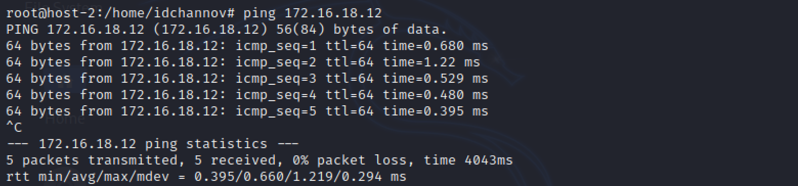

# Exp-08 防火墙的基本配置与使用

### 1. 实验目的

- [x] 了解防火墙的工作原理、基本配置与使用方法

### 2. 实验要求

- [x] 对host-2 iptables的配置脚本逐行添加注释

- [x] 通过实验回答以下问题

    - host-1可以ping通ip: 172.16.18.1吗？   **可以**

    - host-1可以ping通ip: 192.168.1.1吗？   **不可以**

    - host-1可以ping通域名: www.baidu.com吗？   **不可以**

    - host-1可以访问： http://www.baidu.com 吗？    **不可以**

    - host-1可以访问：http://61.135.169.121 吗？    **可以**

    - host-3可以ping通ip: 172.16.18.1吗？   **可以**

    - host-3可以ping通ip: 192.168.1.1吗？   **不可以**

    - host-3可以访问互联网吗？  **不可以**

### 3. 实验环境

- 网络拓扑

    

- 节点信息描述

    | 虚拟机名称 |      网卡选择      |      IP地址       |      MAC地址      |
    | :--------: | :----------------: | :---------------: | :---------------: |
    |  host-gw   |        NAT         |   10.0.2.15/24    | 08:00:27:5d:de:70 |
    |            |   Host-Only网络    | 192.168.56.113/24 | 08:00:27:a4:bd:00 |
    |            | 内部网络，intnet-3 |  192.168.1.1/24   | 08:00:27:69:7c:a8 |
    |   host-1   | 内部网络，intnet-3 |  172.16.18.11/16  | 08:00:27:05:d1:45 |
    |   host-2   | 内部网络，intnet-3 | 192.168.1.123/16  | 08:00:27:fc:0f:f3 |
    |            |                    |  172.16.18.1/16   | 08:00:27:fc:0f:f3 |
    |   host-3   | 内部网络，intnet-3 |  172.16.18.12/16  | 08:00:27:94:df:11 |

- 基本网络连通性检验

    - host-gw <==> host-2

        

        

    - host-1 <==> host-2

        

        

    - host-2 <==> host-3

        

        

    - host-2 <==> Internet

        

### 4. 实验过程

- **实验环境搭建**

    - host-gw

        ```cmd
        # 编辑网络配置文件
        vim /etc/netplan/01-netcfg.yml
        # 使用测试命令看配置是否成功
        netplan try
        # 若成功则应用新配置
        netplan apply

        # 配置防火墙过滤规则
        iptables -t nat -A POSTROUTING -s 192.168.1.0/24 -o enp0s3 -j MASQUERADE
        iptables -t nat -A POSTROUTING -s 192.168.1.0/24 ! -d 192.168.0.0/16 -o enp0s3 -j MASQUERADE
        iptables -P FORWARD DROP
        iptables -A FORWARD -m state --state RELATED,ESTABLISHED -j ACCEPT
        iptables -A FORWARD -s '192.168.1.0/24' ! -d '192.168.0.0/16' -j ACCEPT
        # 保存当前防火墙过滤规则到文件，便于后续使用
        iptables-save > /etc/iptables.rule
        # 防火墙规则应用（重新启动时）
        iptables-restore < /etc/iptables.rule
        # 开启数据转发功能，取消net.ipv4.ip_forward=1的注释
        vim /etc/sysctl.conf
        # 使数据转发功能生效（永久）
        sysctl -p

        # 配置DNS本地解析服务
        # 删除符号链接的resolv.conf文件
        ls -lh /etc/resolv.conf
        rm /etc/resolv.conf
        # 创建新的 resolv.conf 文件
        echo "nameserver 8.8.8.8" > /etc/resolv.conf
        # 安装dnsmasq
        apt-get install dnsmasq
        # 备份dnsmasq配置文件
        cp /etc/dnsmasq.conf /etc/dnsmasq.conf.bak
        # 编辑dnsmasq配置文件
        vim /etc/dnsmasq.conf
        # 重启dnsmasq服务
        systemctl restart dnsmasq
        ```

        **/etc/netplan/01-netcfg.yml**

        ```yaml
        network:
            version: 2
            renderer: networkd
            ethernets:
                enp0s3:
                dhcp4: yes
                enp0s8:
                dhcp4: yes
                dhcp-identifier: mac
                enp0s9:
                addresses: [192.168.1.1/24]
        ```

        **/etc/dnsmasq.conf**

        ```conf
        # Listen on the standard DNS port
        port=53
        # Never forward plain names (without a dot or domain part)
        domain-needed
        # Never forward addresses in the non-routed address spaces.
        bogus-priv
        # Uncommenting this forces dnsmasq to try each query
        # with  each  server  strictly  in  the  order  they   appear   in
        # /etc/resolv.conf
        strict-order
        # Let dnsmasq listen for DHCP and DNS requests only on specified interfaces
        interface=enp0s9
        # Dnsmasq listen on by address (remember to include 127.0.0.1 if
        # you use this.)
        listen-address=192.168.1.1,127.0.0.1
        ```

    - host-1

        **/etc/network/interfaces**

        ```
        auto lo
        iface lo inet loopback

        auto eth0
        iface eth0 inet static
        address 172.16.18.11
        gateway 172.16.18.1
        netmask 255.255.0.0
        ```

        **/etc/resolv.conf**

        ```
        nameserver 192.168.1.1
        ```

    - host-2

        ```cmd
        # 编辑网络配置文件
        vim /etc/network/interfaces
        # 编辑域名解析服务器地址
        vim /etc/resolv.conf

        # 加载防火墙过滤规则
        bash iptables.sh
        # 开启数据转发功能，取消net.ipv4.ip_forward=1的注释
        vim /etc/sysctl.conf
        # 使数据转发功能生效（永久）
        sysctl -p
        ```

        **/etc/network/interfaces**

        ```
        auto lo
        iface lo inet loopback

        auto eth0
        iface eth0 inet static
        address 192.168.1.123
        netmask 255.255.255.0
        gateway 192.168.1.1

        auto eth0:0
        iface eth0:0 inet static
        address 172.16.18.1
        netmask 255.255.255.0
        gateway 192.168.1.1
        ```

        **/etc/resolv.conf**

        ```
        nameserver 192.168.1.1
        ```

    - host-3

        **/etc/network/interfaces**

        ```
        auto lo
        iface lo inet loopback

        auto eth0
        iface eth0 inet static
        address 172.16.18.12
        gateway 172.16.18.1
        netmask 255.255.0.0
        ```


        **/etc/resolv.conf**
    
        ```
        nameserver 192.168.1.1
        ```

- **对iptables配置脚本添加注释**

    ```shell

    #!/bin/bash

    IPT="/sbin/iptables"

    # 删除host-2现有的iptables规则
    $IPT --flush
    # 删除host-2的用户定义链
    $IPT --delete-chain

    # 丢弃符合内置链过滤规则的输入数据包
    $IPT -P INPUT DROP
    # 丢弃符合内置链过滤规则的转发数据包
    $IPT -P FORWARD DROP
    # 允许符合内置链过滤规则的数据包输出
    $IPT -P OUTPUT ACCEPT

    # 创建名为forward_demo的用户自定义链
    $IPT -N forward_demo
    # 创建名为icmp_demo的用户自定义链
    $IPT -N icmp_demo

    # 向INPUT链的尾部添加一条规则：
    # 允许回环接口输入数据包
    $IPT -A INPUT -i lo -j ACCEPT
    # 向OUTPUT链的尾部添加规则：
    # 允许回环接口输出数据包
    $IPT -A OUTPUT -o lo -j ACCEPT

    # 向INPUT链的尾部添加一条规则：
    # TCP连接开始时需要接受SYN数据包
    $IPT -A INPUT -p tcp ! --syn -m state --state NEW -s 0.0.0.0/0 -j DROP

    # 向INPUT链的尾部添加一条规则：
    # 允许接受对于通信双方均可见的数据包与连接刚建立时发送的数据包
    $IPT -A INPUT -m state --state ESTABLISHED,RELATED -j ACCEPT

    # 向INPUT链的尾部添加一条规则：
    # 对输入的ICMP包应用icmp_demo中定义的过滤规则
    $IPT -A INPUT -p icmp -j icmp_demo

    # 向icmp_demo链的尾部添加一条规则：
    # 允许在eth0网络接口接受ICMP数据包
    $IPT -A icmp_demo -p icmp -i eth0 -j ACCEPT
    # 向icmp_demo链的尾部添加一条规则：
    # 停止遍历icmp_demo，并在上一个调用链中的下一个规则处恢复遍历
    $IPT -A icmp_demo -j RETURN

    # 向FORWARD链的尾部添加一条规则：
    # 对转发的数据包应用forward_demo中定义的过滤规则
    $IPT -A FORWARD -j forward_demo

    # 向forward_demo链的尾部添加一条规则：
    # 打开匹配过滤规则的数据包中具有FORWARD_DEMO前缀的内核日志记录
    $IPT -A forward_demo -j LOG --log-prefix FORWARD_DEMO
    # 向forward_demo链的尾部添加一条规则：
    # 使用Boyer-Moore模式匹配策略丢弃在80端口传输的带有baidu字样的TCP包
    $IPT -A forward_demo -p tcp --dport 80 -m string --algo bm --string 'baidu' -j DROP
    # 向forward_demo链的尾部添加一条规则：
    # 接受来自172.16.18.11的TCP包
    $IPT -A forward_demo -p tcp -s 172.16.18.11 -j ACCEPT
    # 向forward_demo链的尾部添加一条规则：
    # 允许向172.16.18.11发送TCP包
    $IPT -A forward_demo -p tcp -d 172.16.18.11 -j ACCEPT
    # 向forward_demo链的尾部添加一条规则：
    # 接受本机53端口接收的来自172.16.18.11的UDP包
    $IPT -A forward_demo -p udp -s 172.16.18.11 --dport 53 -j ACCEPT
    # 向forward_demo链的尾部添加一条规则：
    # 接受本机53端口接收的来自172.16.18.1的UDP包
    $IPT -A forward_demo -p udp -s 172.16.18.1  --dport 53 -j ACCEPT
    # 向forward_demo链的尾部添加一条规则：
    # 接受来自192.168.1.1的53端口处发送的UDP包
    $IPT -A forward_demo -p udp -s 192.168.1.1  --sport 53 -j ACCEPT
    # 向forward_demo链的尾部添加一条规则：
    # 接受来自172.16.18.1发送的TCP包
    $IPT -A forward_demo -p tcp -s 172.16.18.1 -j ACCEPT
    # 向forward_demo链的尾部添加一条规则：
    # 停止使用forward_demo中定义的过滤规则对来自172.16.18.1的数据包进行匹配
    $IPT -A forward_demo -s 172.16.18.1 -j RETURN

    # 对使用拨号方式建立的动态连接中来自172.16.18.1/24的数据包，在eth0端口进行NAT转发
    $IPT -t nat -A POSTROUTING -s 172.16.18.1/24 -o eth0 -j MASQUERADE
    ```

- **连通性测试**

    - host-1可以ping通ip: 172.16.18.1吗？

        **【ANS】** 可以

        

    - host-1可以ping通ip: 192.168.1.1吗？

        **【ANS】** 不可以

        

    - host-1可以ping通域名: www.baidu.com吗？

        **【ANS】** 不可以

        

    - host-1可以访问：http://www.baidu.com 吗？

        **【ANS】** 不可以

        

    - host-1可以访问：http://61.135.169.121 吗？

        **【ANS】** 可以

        

    - host-3可以ping通ip: 172.16.18.1吗？

        **【ANS】** 可以

        

    - host-3可以ping通ip: 192.168.1.1吗？

        **【ANS】** 不可以

        

    - host-3可以访问互联网吗？

        **【ANS】** 不可以

        

### 5. 遇到的问题

- 客户端与网关之间不连通，经排查后为链路层连通性问题（host-1/3 & host-2）

    

    

    **错误原因：** host-2的网卡类型配置错误，应为intnet

    **解决方法:** 将host-2的网卡改为intnet

- host-2无法连接互联网

    **错误原因：** host-2与host-gw没有开启数据转发功能

    **解决方法：** 开启数据转发功能，并配置相应的防火墙规则

### 6. 参考资料

- [Kali linux单网卡设定多个固定IP的方法 -- 知乎](https://zhuanlan.zhihu.com/p/61528603)

- [基本网络故障排查方法 -- CSDN](https://blog.csdn.net/qq_44714603/article/details/88749922)

- [How to Install and Configure Dnsmasq on Ubuntu 18.04 LTS](https://computingforgeeks.com/install-and-configure-dnsmasq-on-ubuntu-18-04-lts/#ex1)

- [iptables(8) - Linux man page](https://linux.die.net/man/8/iptables)

- [iptables example](https://www.manniwood.com/2016_09_04/iptables.html)

### 7. 实验说明

由于课内实验已于课上完成，因此本实验报告仅包括课外实验部分。
