# Exp-09 入侵检测

### 1. 实验目的

- [x] 了解入侵检测的基本原理与实现方法

### 2. 实验环境

- 网络拓扑

    

- 节点信息描述

    | 虚拟机名称 |   网卡选择    |      IP地址       |      MAC地址      |
    | :--------: | :-----------: | :---------------: | :---------------: |
    |  endian-1  | 网络地址转换  |   10.0.2.15/24    | 08:00:27:89:d4:45 |
    |            | Host-Only网络 | 192.168.56.117/24 | 08:00:27:f7:39:a7 |
    |  endian-2  | 网络地址转换  |   10.0.2.15/24    | 08:00:27:33:7a:32 |
    |            | Host-Only网络 | 192.168.56.118/24 | 08:00:27:52:7f:72 |

- 软件环境

    - Snort - 2.9.7.0 GRE

    - Suricata - 3.2.1

### 3. 实验准备

- 安装Snort

    ```
    # 禁止在apt安装时弹出交互式配置界面
    export DEBIAN_FRONTEND=noninteractive
    # 安装snort
    apt install snort
    # 开启测试模式测试snort配置
    snort -T -c /etc/snort/snort.conf
    ```

    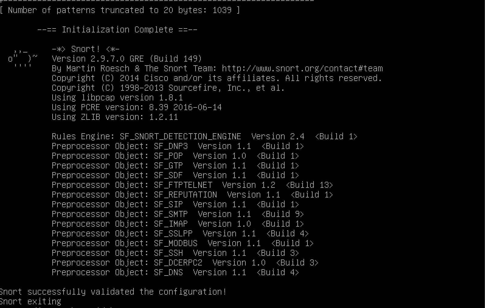

### 4. 实验过程

- **实验一**

    ```
    # 显示IP/TCP/UDP/ICMP头
    snort –v

    # 显示应用层数据
    snort -vd

    # 显示数据链路层报文头
    snort -vde

    # -b 参数表示报文存储格式为 tcpdump 格式文件
    # -q 静默操作，不显示版本欢迎信息和初始化信息
    snort -q -v -b -i enp0s8 "port not 22"
    ```

    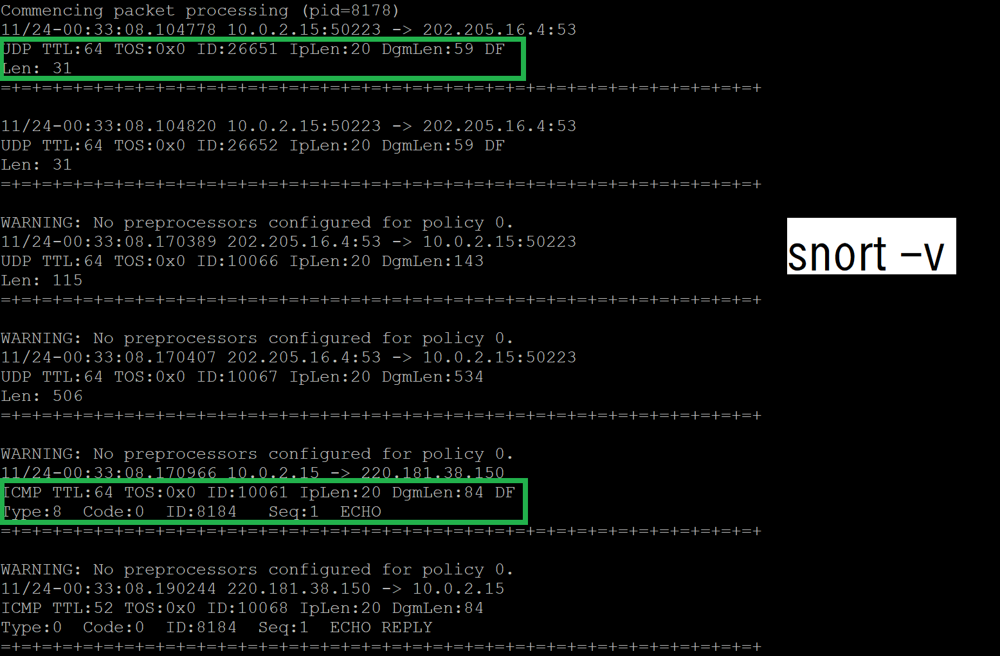

    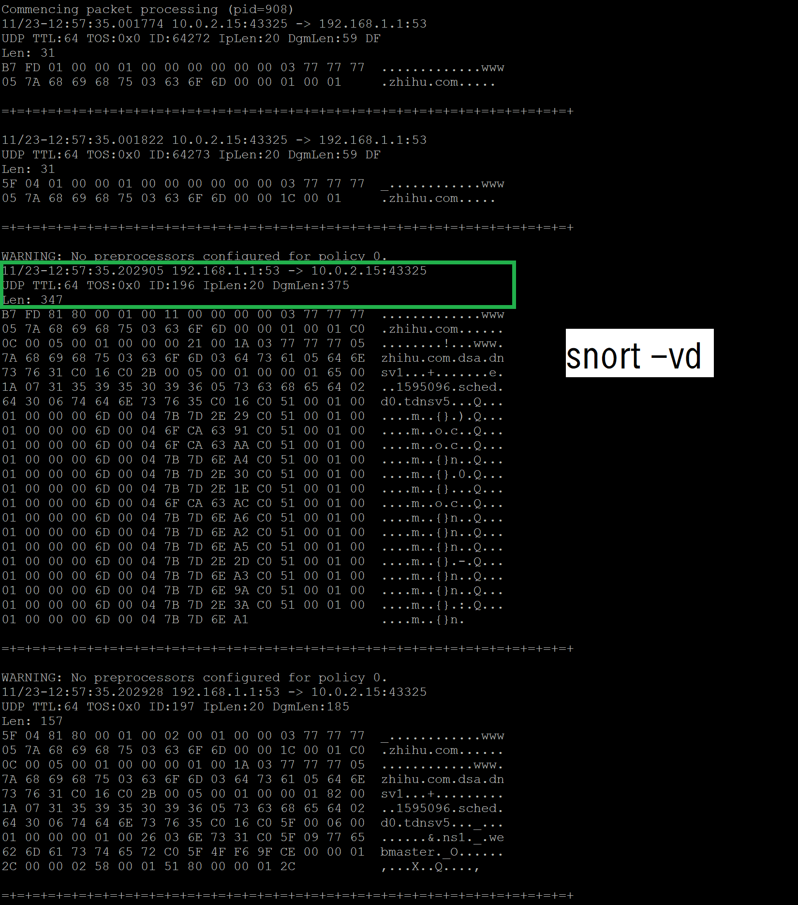

    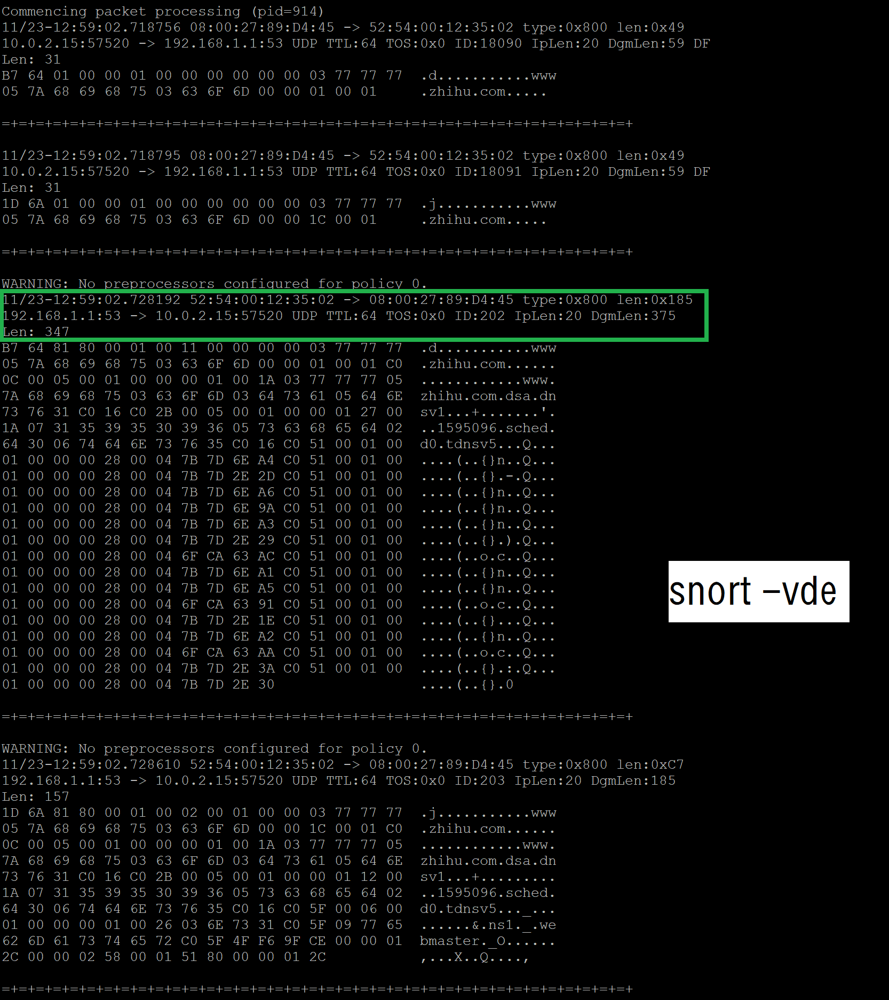

    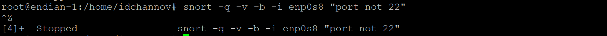

- **实验二**

    ```
    # 正确定义HOME_NET 和 EXTERNAL_NET，处于学习与实验目的将之设为any
    vim /etc/snort/snort.conf
    # 启用snort内置规则
    snort -q -A console -b -i enp0s8 -c /etc/snort/snort.conf -l /var/log/snort/
    ```

    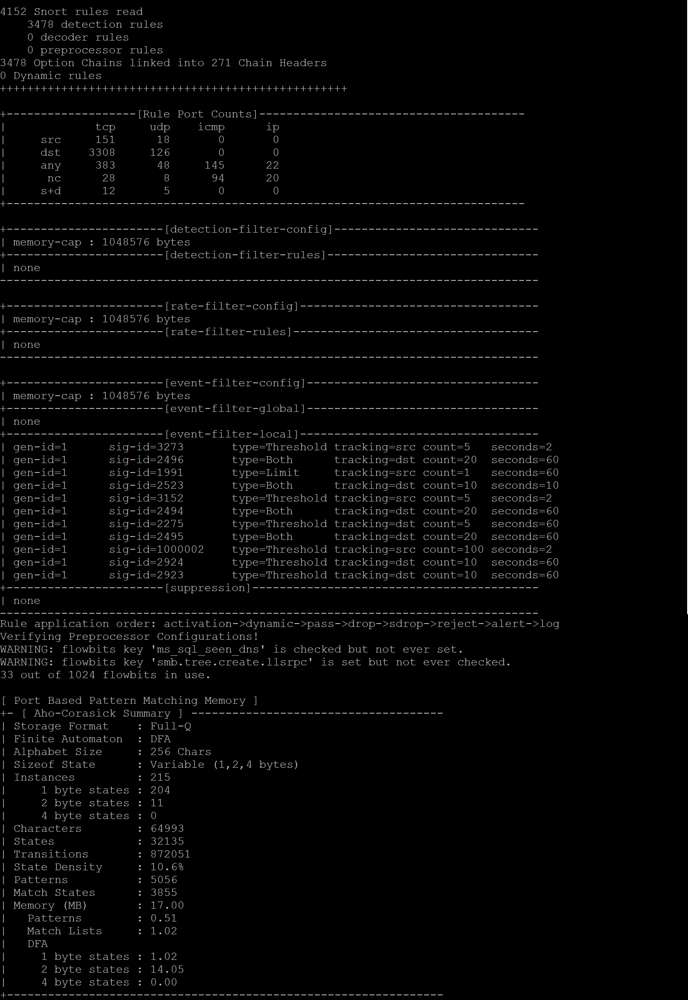

- **实验三**

    ```
    # 新建自定义 snort 规则文件
    cat << EOF > /etc/snort/rules/cnss.rules
    alert tcp \$EXTERNAL_NET any -> \$HTTP_SERVERS 80 (msg:"Access Violation has been detected on /etc/passwd ";flags: A+; content:"/etc/passwd"; nocase;sid:1000001; rev:1;)
    alert tcp \$EXTERNAL_NET any -> \$HTTP_SERVERS 80 (msg:"Possible too many connections toward my http server"; threshold:type threshold, track by_src, count 100, seconds 2; classtype:attempted-dos; sid:1000002; rev:1;)
    EOF

    # 添加如下配置代码到 /etc/snort/snort.conf
    include $RULE_PATH/cnss.rules
    ```

    使用endian-2对endian-1的进行端口扫描（port：80）后发现endian-1的检测日志中出现如下内容：

    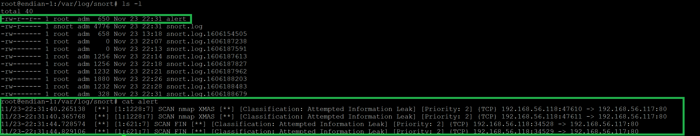

- **实验四**

    - 基本网络连通性检验

        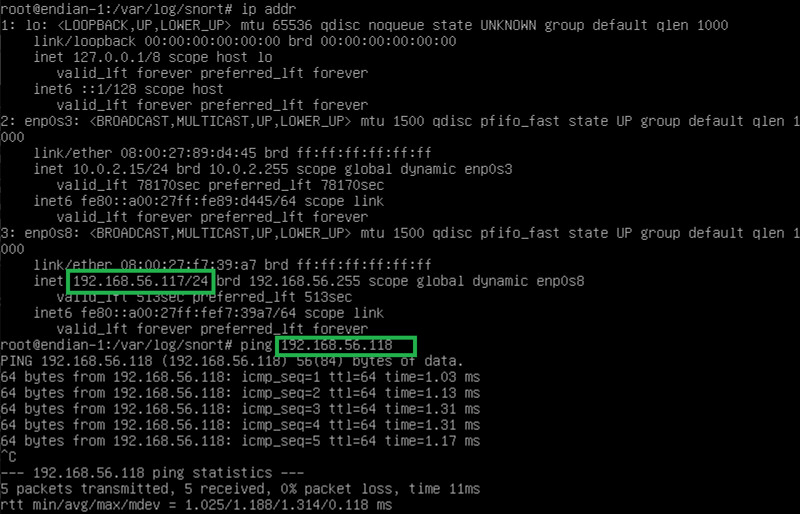

        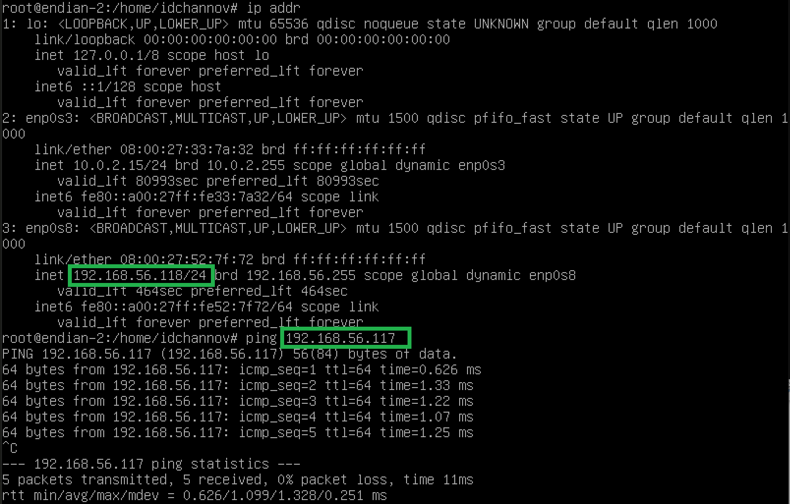

    - 实验流程

        - endian-1

            ```
            # 下载 Guardian-1.7.tar.gz 
            curl -o guardian.tar.gz https://c4pr1c3.github.io/cuc-ns/chap0x09/attach/guardian.tar.gz
            # 解压缩 Guardian-1.7.tar.gz
            tar zxf guardian.tar.gz
            # 安装 Guardian 的依赖 lib
            apt install libperl4-corelibs-perl
            # 切换至guardian的目录下
            cd dir_of_guardian
            # 编辑配置文件
            vim guardian.conf
            # 开启 snort
            snort -q -A fast -b -i enp0s8 -c /etc/snort/snort.conf -l /var/log/snort/
            # 启动 guardian.pl
            perl guardian.pl -c guardian.conf
            ```

            **guardian/guardian.conf**

            ```
            HostIpAddr      192.168.56.117
            Interface       enp0s8
            ```

        - endian-2

            ```
            # 用 nmap 暴力扫描 endian-1
            nmap 192.168.56.117 -A -T4 -n -vv
            ```

        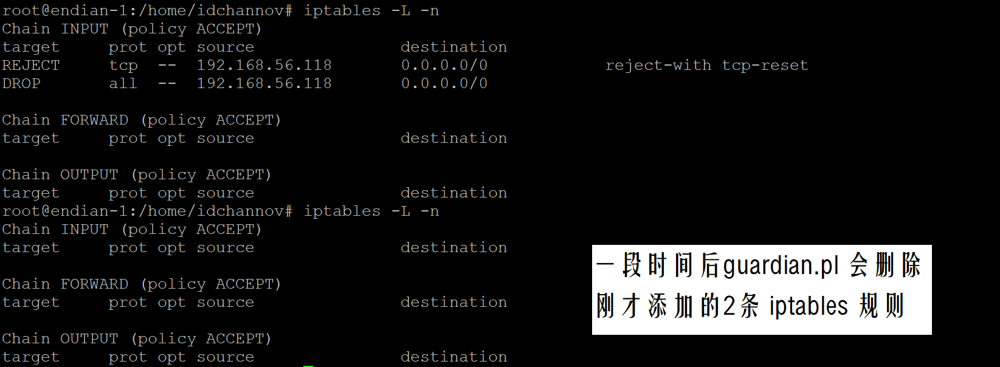

        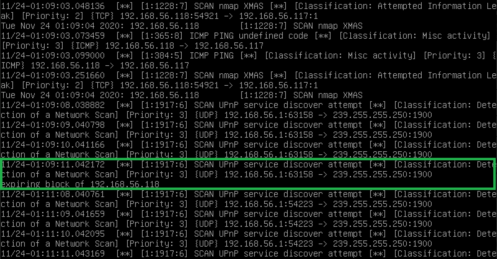

### 5. 实验思考题

- IDS与防火墙的联动防御方式相比IPS方式防御存在哪些缺陷？是否存在相比较而言的优势？

    - **缺陷：** 无法实现针对攻击事件或异常行为的感知及预防；
        - IDS + 防火墙：实现对网络的访问控制，并对已发生的攻击事件或异常行为进行处理。
        
        - IPS：可以根据设置的过滤器，分析相对应的数据包，通过检查的数据包可以继续前进，包含恶意内容的数据包就会被丢弃，被怀疑的数据包需要接受进一步的检查。

    - **优势：** 
        - 在硬件条件相同的情况下性能更强
        
        - 在UDP协议逐渐拓宽使用的情况下误杀率可能会低于IPS

- 使用 Suricata 代替 Snort ，重复本实验

    - 网络配置信息变更

        - 网络拓扑

            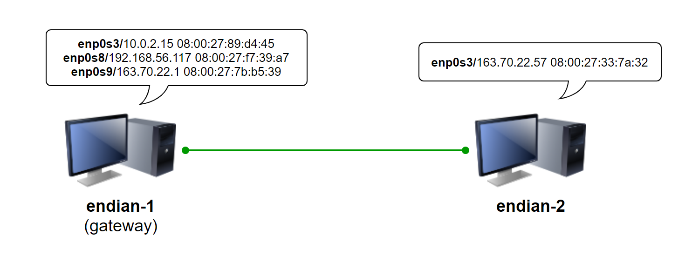

        - 节点信息描述

            | 虚拟机名称 |     网卡选择     |      IP地址       |      MAC地址      |
            | :--------: | :--------------: | :---------------: | :---------------: |
            |  endian-1  | NAT 网络，ID-net |   10.0.2.15/24    | 08:00:27:89:d4:45 |
            |            |  Host-Only网络   | 192.168.56.117/24 | 08:00:27:f7:39:a7 |
            |            |     intnet3      |  163.70.22.1/24   | 08:00:27:7b:b5:39 |
            |  endian-2  |     intnet3      |  163.70.22.57/16  | 08:00:27:33:7a:32 |

        - 网络连通性检验

            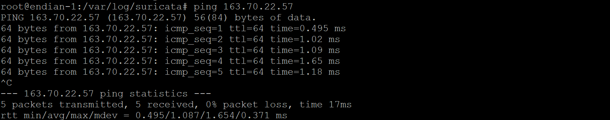

            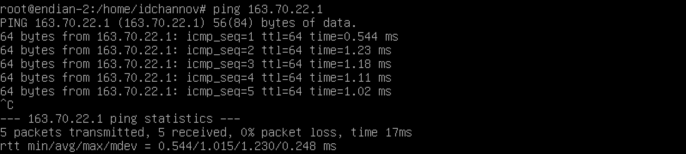

    - 实验过程

        - **实验一**

            ```
            # 开启日志记录
            # 默认情况下，开启日志记录后所有数据包都会被记录，除了：
            # 1. TCP流超出stream.reassembly.depth
            # 2. 密钥交换后加密的流
            vim /etc/suricata/suricata.yaml
            # 开启Suricata对端口enp0s3的嗅探模式
            suricata -i enp0s3
            ```

            **/etc/suricata/suricata.yaml**

            ```yaml
            - pcap-log:
                enabled:  yes
                filename: log.pcap
            ```

            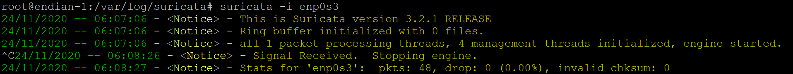

            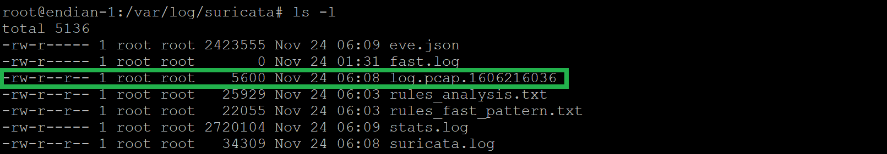

        - **实验二**

            ```
            # 查看Suricata的内置规则
            ls -l /etc/suricata/rules
            # 以独占方式启用Suricata的内置规则
             suricata -c /etc/suricata/suricata.yaml -i enp0s3 -S /etc/suricata/rules/dns-events.rules
            ```

            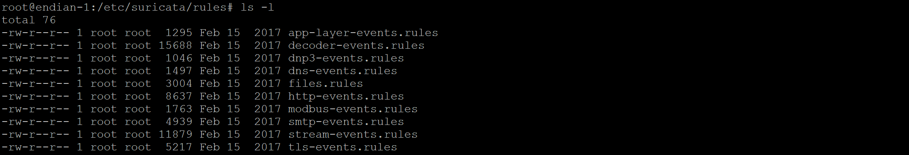

            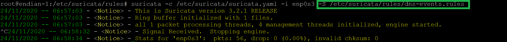

            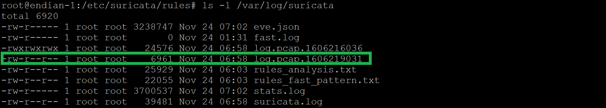

        - **实验三**

            ```
            # 编写自定义预警规则
            vim /etc/suricata/rules/self-def.rules
            # 将自定义规则添加至配置文件
            vim /etc/suricata/suricata.yaml
            # 以独占方式启用自定义规则
            suricata -c /etc/suricata/suricata.yaml -i enp0s3 -S /etc/suricata/rules/self-def.rules
            # 访问www.baidu.com
            curl http://www.baidu.com
            # 查看预警信息
            cat /var/log/suricata/fast.log
            ```

            **/etc/suricata/rules/self-def.rules**

            ```
            # 访问www.baidu.com时发出预警信息
            alert http any any -> any any (msg:"visiting www.baidu.com...";content:"baidu";reference:url,www.baidu.com;)
            ```

            **/etc/suricata/suricata.yaml**
            
            ```yaml
            default-rule-path: /etc/suricata/rules
            rule-files:
                # add self-defined rules
                - self-def.rules
            ```

            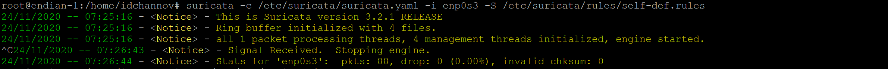

            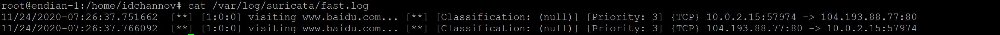

        - **实验四**

            - endian-1

                ```
                # 开启Suricata扫描enp0s9网络接口
                suricata -c /etc/suricata/suricata.yaml -i enp0s9
                # 切换至guardian的目录下
                cd dir_of_guardian
                # 启动 guardian.pl
                perl guardian.pl -c guardian.conf
                ```

            - endian-2

                ```
                # 用 nmap 暴力扫描 endian-1
                nmap 163.70.22.1 -A -T4 -n -vv
                ```

            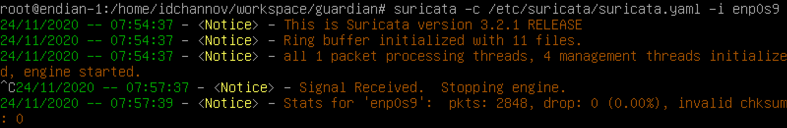

            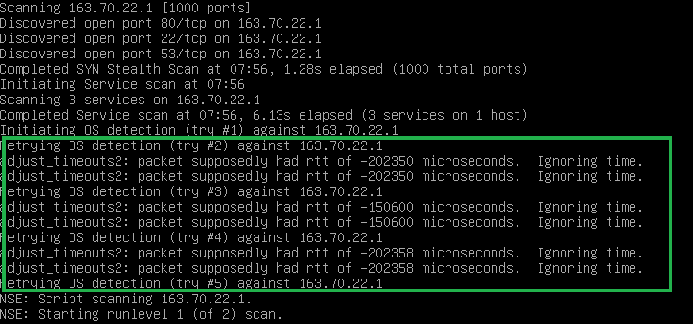

- 配置 Suricata 为 IPS 模式，重复实验四

    ```
    # 一下为不同方案的iptables选型，此处选用【1】
    # 1. 发送通过计算机的流量到Suricata：
    iptables -I FORWARD -j NFQUEUE
    # 2. 发送由本机生成的流量到Suricata：
    iptables -I INPUT -j NFQUEUE
    iptables -I OUTPUT -j NFQUEUE
    ```

    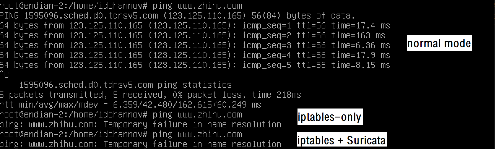

    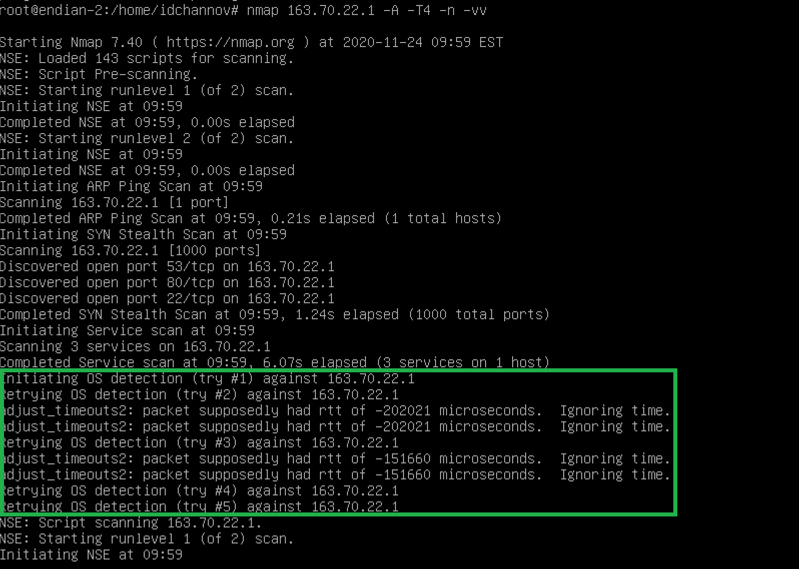

    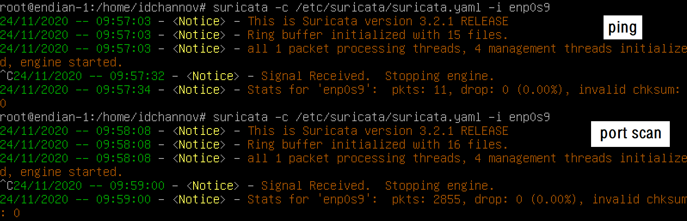

### 6. 遇到的问题

- 安装snort失败，报错信息为`Unable to locate package snort`

    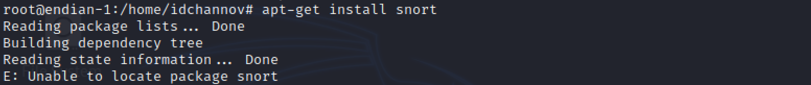

    **错误原因：** 安装在Kali环境下进行，而当前Kali源里不对该软件包进行维护

    **解决方法（可选）：** 
    
    - 在Debian环境下重新执行安装操作

        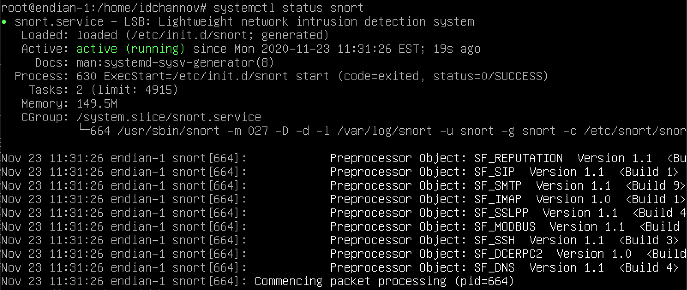

        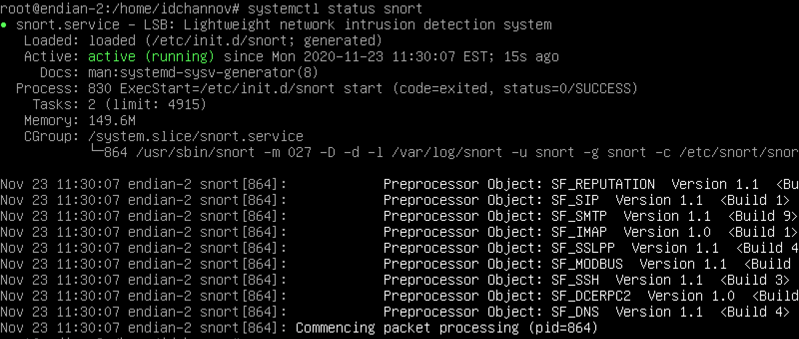

    - 增添镜像源

- snort安装完成后运行时报错：`bash: snort: command not found`

    **错误原因：** /usr/sbin/snort没有在环境变量中

    **解决方法：** 执行如下命令，将系统中所有用户的/sbin目录都添加为环境变量（偷懒做法…耶XD）

    ```
    # 文末添加export PATH=$PATH:/sbin
    vim /etc/profile
    source /etc/profile
    ```

- 运行suricata时报错如下

    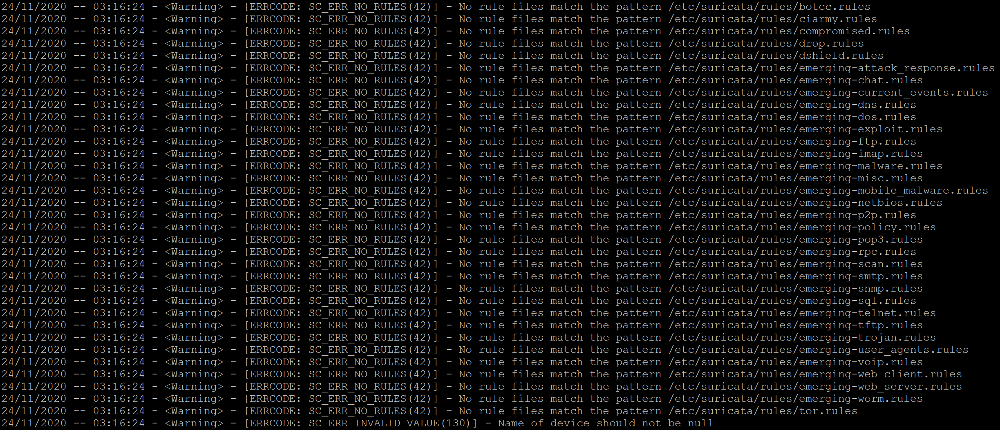

    **错误原因：** /etc/suricata/suricata.yaml中许多启用的规则不在/etc/suricata/rules目录下

    **解决方法：** 将不存在的规则注释即可

    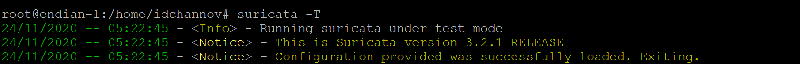

- **【Unsolved】** Suricata与防火墙联动时可以实现屏蔽endian-2的访问，但在endian-1端执行`iptables -L -n`时没有出现相应的规则

    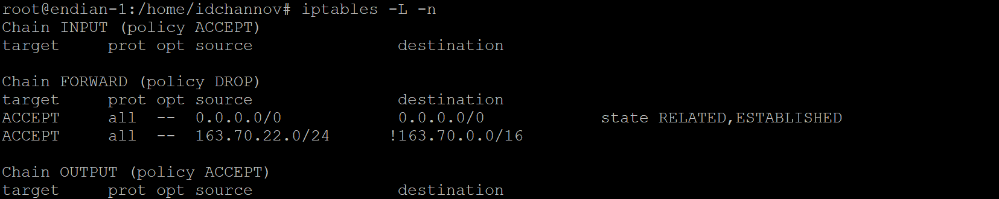

### 7. 参考资料

- [How To Install Debian 10 (Buster)](https://phoenixnap.com/kb/how-to-install-debian-10-buster)

- [How to install Snort on Debian](https://upcloud.com/community/tutorials/installing-snort-on-debian/)

- [Network Intrusion Detection System Mode - Snort Official](http://manual-snort-org.s3-website-us-east-1.amazonaws.com/node6.html)

- [「网络安全」安全设备篇（防火墙、IDS、IPS的区别-UTM-WAF）](https://zhuanlan.zhihu.com/p/96095908)

- [How to Configure & Use Suricata for Threat Detection](https://resources.infosecinstitute.com/topic/configure-use-suricata-threat-detection/)

- [Suricata User Guide](https://suricata.readthedocs.io/en/suricata-6.0.0/)