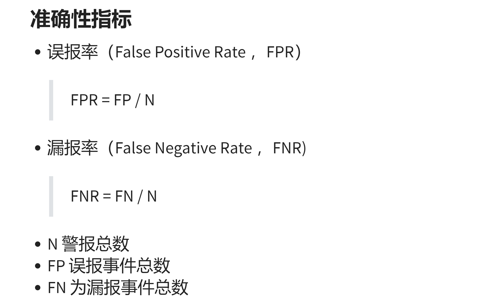

# Q&A

- 如何理解“入侵检测系统的误报率越高，漏报率低的概率就越高”这句话？

    **【ANS】** 
    
    

    - 误报率高说明误报事件总数（FP）高，由于 N = FP + FN ，因此漏报事件总数（FN）低

    - 误报率高说明入侵检测系统对异常行为敏感，因此漏报的可能性就低

- 描述入侵检测系统的误用检测算法和异常检测算法，并各举一实际算法说明

    - 误用检测算法：通过按预先定义好的入侵模式以及观察到入侵发生的情况进行模式匹配来检测

        - 例：基于专家系统的误用检测

            > 该方法将有关入侵的知识转化成 if - then 结构的规则，即将构成入侵所要求的条件转化为if部分，将发现入侵后采取的相应措施转化成then部分。当其中某个或某部分条件满足时，系统就判断为入侵行为发生。其中的 if - then 结构构成了描述具体攻击的规则库。
            >
            > 条件部分，即 if 后的规则化描述，可根据审计事件得到，然后根据规则和行为进行判断，执行 then 后的动作。
            >
            > 在具体实现中，专家系统需要从各种入侵手段中抽象出全面的规则化知识，需处理大量数据，在大型系统上尤为明显。因此，大多运用与专家系统类似的特征分析法。

    - 异常检测算法：通过数据挖掘手段识别数据中的“异常点”

        - 例：基于特征选择的异常检测

            > 离群点的特征选择方法：
            > 1. 评分卡方法：利用信息价值（Information Value）和证据权重（Weight of Evidence）选择合适的特征
            > 2. 遗传算法：利用优化算法来选择特征，选择标记为1，不选标记为0，通过选择最优个体、组合交叉和变异，使适应度函数达到最优解，进而得到合适的特征
            > 3. 峰度检验：通过对数据自身的分布和统计量来估计该特征是否包含异常值

# 参考资料

- [异常检测的特征选择方法 - 知乎](https://zhuanlan.zhihu.com/p/66813357)

- [在误用检测技术的实现中常见五种方法 - 百科智库](https://www.tmzhiku.com/zhishi/54866.html)