# Exp-0A 基于fail2ban的安全加固

### 1. 实验目的

- [x] 了解安全加固的基本原理与实现方法

### 2. 实验要求

- [x] 使用fail2ban实现SSH安全加固

### 3. 实验环境

- 网络拓扑

    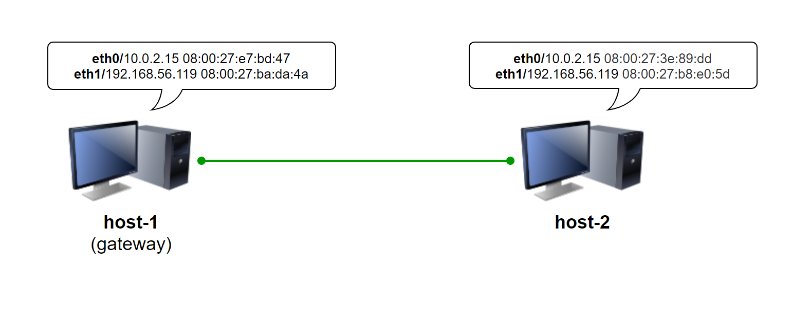

- 网络连通性检验

    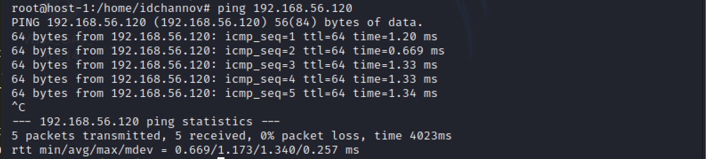

    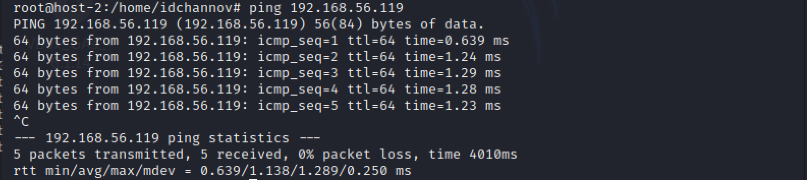

- 节点信息描述

    | 虚拟机名称 |     网卡选择     |      IP地址       |      MAC地址      |
    | :--------: | :--------------: | :---------------: | :---------------: |
    |  host-1  | NAT|   10.0.2.15/24    | 08:00:27:e7:bd:47 |
    |            |  Host-Only网络   | 192.168.56.119/24 | 08:00:27:ba:da:4a |
    |  host-2  |     NAT      |  10.0.2.15/24   | 08:00:27:3e:89:dd |
    |            |  Host-Only网络   | 192.168.56.120/24  | 08:00:27:b8:e0:5d |

- 软件环境

    - fail2ban - 0.11.1-2
    
    - Hydra - 9.0-1

    - Medusa - v2.2

    - X-Hydra

    - Metasploit - 5.0.99-dev

    - Patator - 0.8

    - Ncrack - 0.7

### 4. 实验过程

- **使用SSH的服务端口暴力破解host-1的登陆密码**

    **【ATTENTION】** 暴力破解软件的用法很多，本实验对单一软件仅使用了有限种方法进行爆破尝试，且进行爆破尝试的数据也很少，这里重在体验软件的使用方法，正常操作思路应该是在爆破时连接数据库😎

    - **Hydra**

        ```
        hydra -L user_list -P password_list dest_IP ssh
        ```

        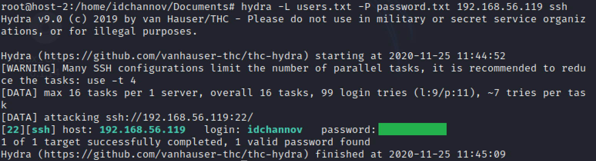

    - **Medusa**

        ```
        medusa -h dest_IP -U user_list -P password_list -M ssh
        ```

        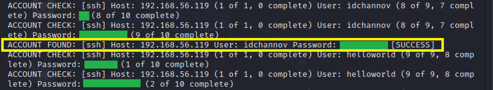

        【个人使用体验】数据集相同的情况下Medusa比Hydra慢很多😒，而且输出界面是真的难看

    - **X-Hydra** (GUI version of Hydra)

        根据应用需求设置爆破方式：

        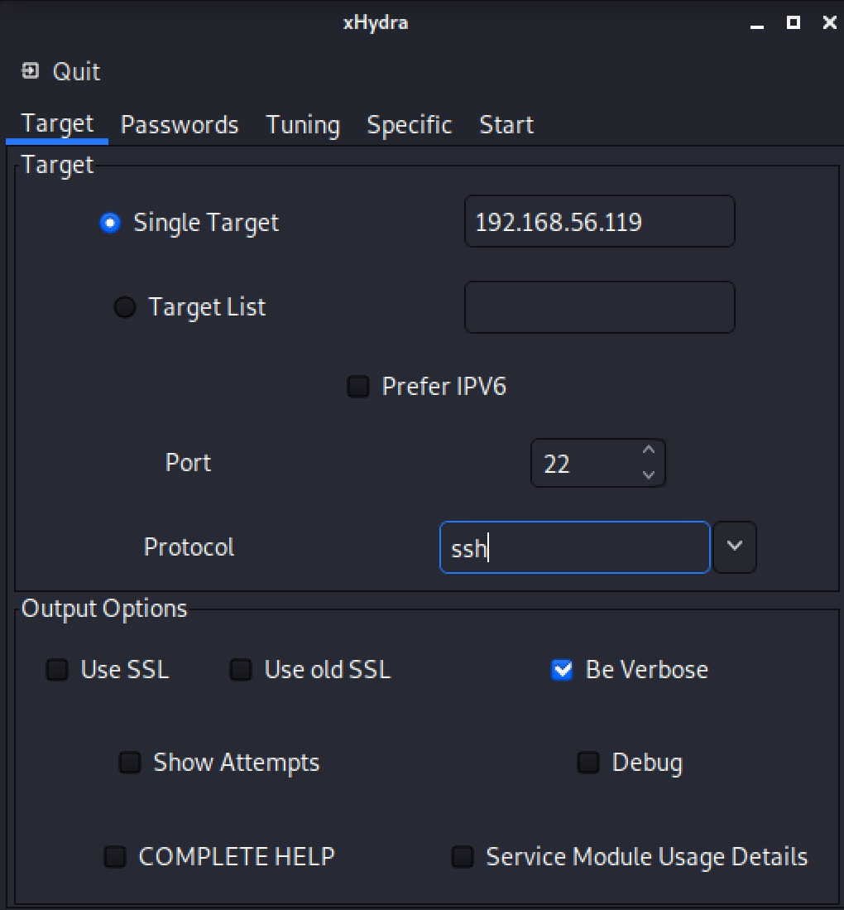

        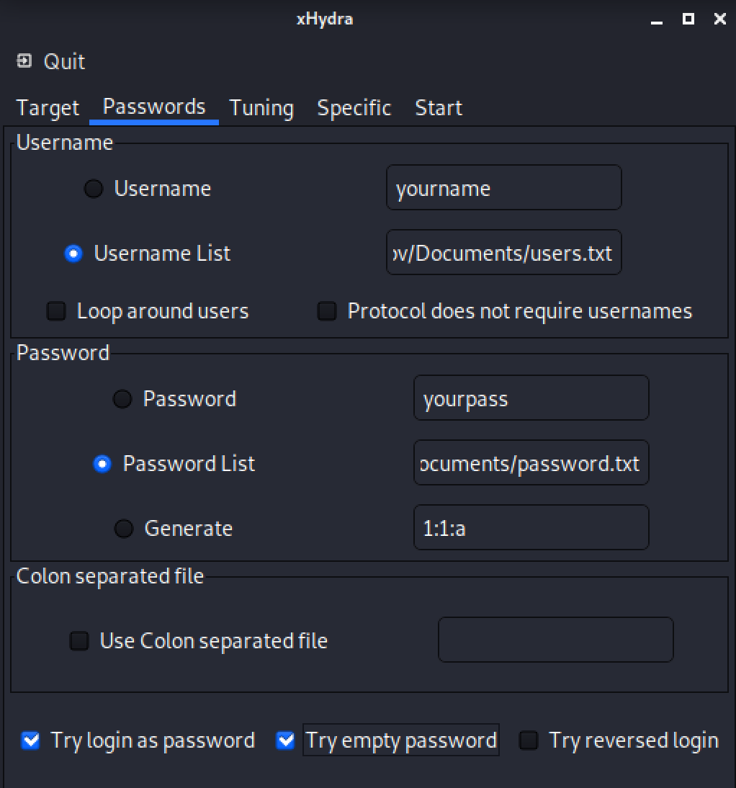

        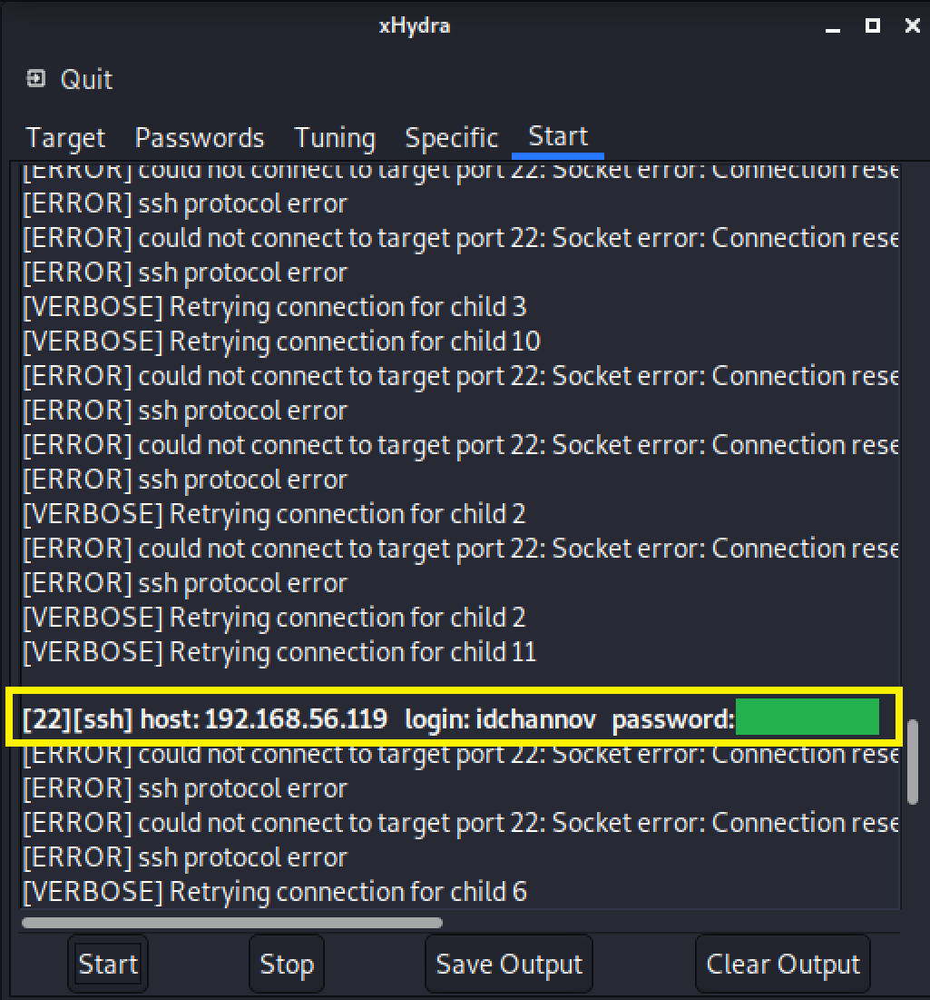

    - **Metasploit**

        ```
        # 进入Metasploit的交互式界面
        msfconsole
        # 根据应用需求设置爆破选项
        use auxiliary/scanner/ssh/ssh_login
        set rhosts dest_IP
        set user_file user_list
        set pass_file password_list
        run
        ```

        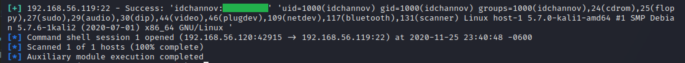

        【个人使用体验】Metasploit虽然爆破速度稍微慢了点，但是爆破完成后提供的远程用户信息还是非常全面的，而且欢迎界面设计的也非常好看，喜欢喜欢👻

    - **Patator**

        ```
        patator ssh_login host=dest_IP user=FILE0 0=user_list password=FILE1 1=password_list
        ```

        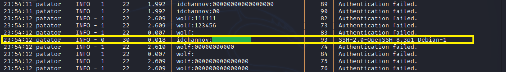

        【个人使用体验】输出界面看起来很舒适👍，相同数据集下速度也很OK，用python写小工具还是蛮不错的

    - **Ncrack**

        ```
        ncrack -U user_list -P password_list dest_IP:SSH_port
        ```

        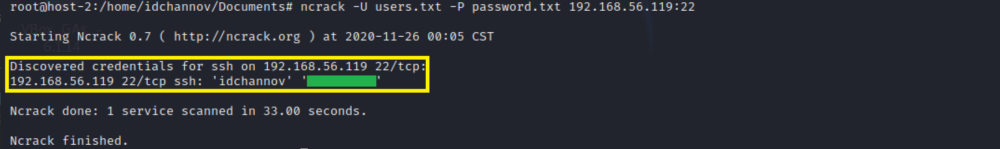

- **使用fail2ban对SSH服务进行安全加固**

    - 设置加固需求

        ```
        # 下载fail2ban
        apt-get install fail2ban
        # 对fail2ban进行一些简单的配置
        vim /etc/fail2ban/jail.conf
        ```

        **/etc/fail2ban/jail.conf**
        ```
        # The length of time in seconds for which an IP is banned. If set to a negative number, the ban will be permanent.
        bantime = 60

        # The length of time between login attempts before a ban is set
        findtime = 60

        # How many attempts can be made to access the server from a single IP before a ban is imposed
        maxretry = 3
        ```

    - 安全性检验

        - Hydra

            

            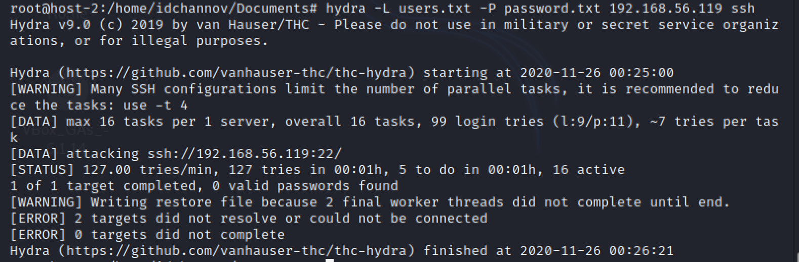

        - Medusa

            通过实验发现，当maxretry设置的很小的时候Medusa的可用性非常低，再加一个bantime因子的话基本就废了（难道是因为本来就慢？

            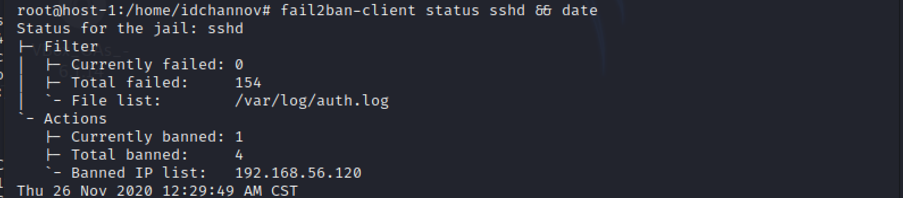

            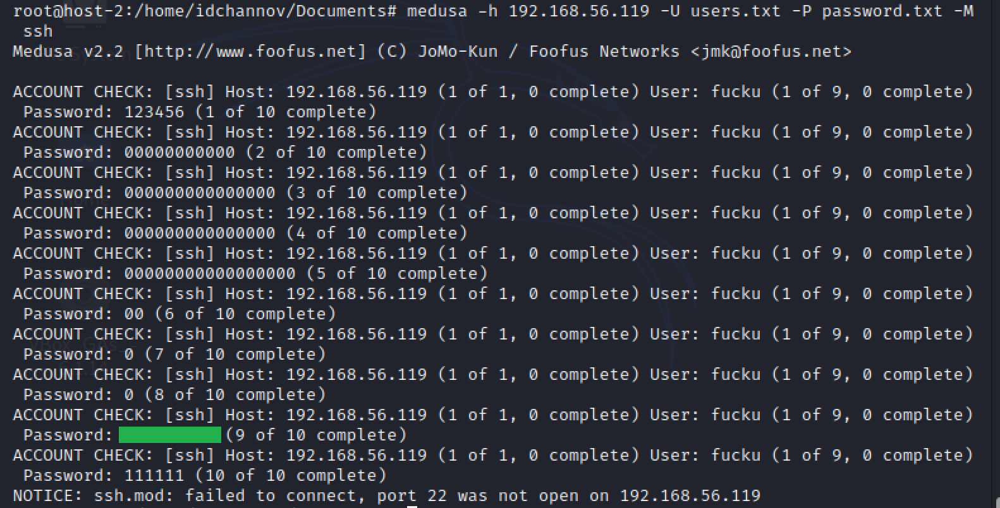

        - X-Hydra

            

            

        - Metasploit

            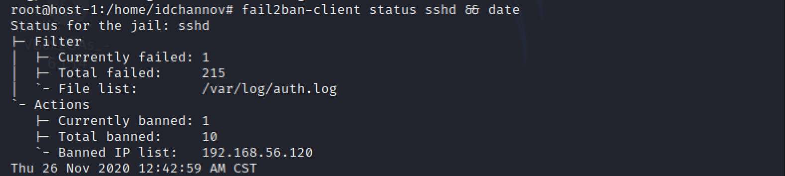

            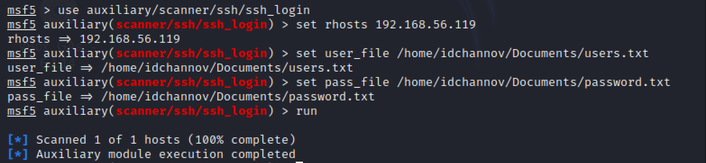

        - Patator

            Patator退出SSH连接的用时也很长，尽管匹配到了正确的用户名与密码但连接还是失败

            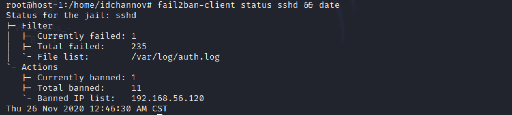

            

        - Ncrack

            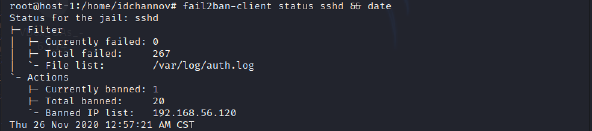

            


### 5. 遇到的问题

- 安装fail2ban时出现报错信息如下：

    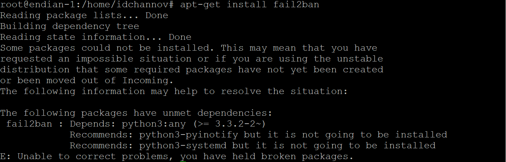

    **错误原因：** Debian中下载fail2ban时某些必需的软件包尚未创建或已从传入列表中移出

    **解决方法：** 在Kali中安装

    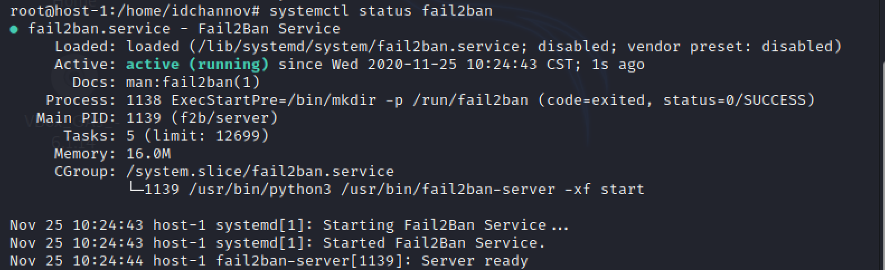

- **【Unsolved】** 不同爆破软件在 host-2 的IP被ban时退出SSH连接的用时不同，不知道退出时间是短点好还是长点好呢？


### 6. 参考资料

- [Password Cracking:SSH](https://www.hackingarticles.in/password-crackingssh/)

- [Using Fail2ban to Secure Your Server - A Tutorial](https://www.linode.com/docs/guides/using-fail2ban-to-secure-your-server-a-tutorial/)