# Exp-0B 常见蜜罐体验和探索

### 1. 实验目的

- [x] 了解蜜罐的分类和基本原理

- [x] 了解不同类型蜜罐的适用场合

- [x] 掌握常见蜜罐的搭建和使用

### 2. 实验要求

- [x] 记录蜜罐的详细搭建过程

    - 从 [paralax/awesome-honeypots](https://github.com/paralax/awesome-honeypots) 中选择 1 种低交互型蜜罐和 1 种中等交互型蜜罐进行搭建实验

    - 推荐 SSH 蜜罐

- [x] 使用 nmap 扫描搭建好的蜜罐并分析扫描结果，同时分析「 nmap 扫描期间」蜜罐上记录得到的信息

- [x] 如何辨别当前目标是一个「蜜罐」？以自己搭建的蜜罐为例进行说明

- [x] 总结常见的蜜罐识别和检测方法

- [ ] 基于 canarytokens 搭建蜜信实验环境进行自由探索型实验

### 3. 实验环境

- 网络拓扑

    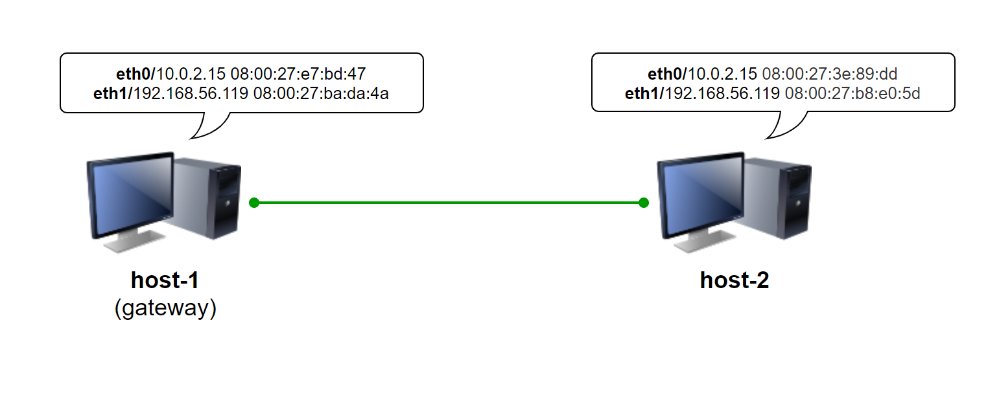

- 节点信息描述

    | 虚拟机名称 |     网卡选择     |      IP地址       |      MAC地址      |
    | :--------: | :--------------: | :---------------: | :---------------: |
    |  host-1  | NAT|   10.0.2.15/24    | 08:00:27:e7:bd:47 |
    |            |  Host-Only网络   | 192.168.56.119/24 | 08:00:27:ba:da:4a |
    |  host-2  |     NAT      |  10.0.2.15/24   | 08:00:27:3e:89:dd |
    |            |  Host-Only网络   | 192.168.56.120/24  | 08:00:27:b8:e0:5d |

- 基本网络连通性检验

    

    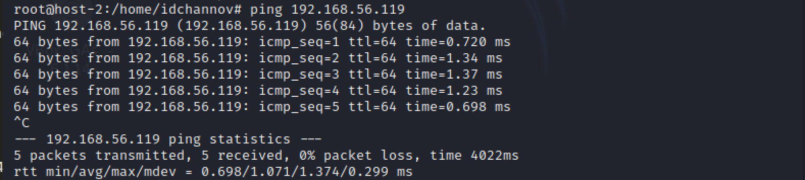

- 软件环境

    - 低交互型蜜罐：SSH Honeypot

    - 中等交互型蜜罐：Cowrie

### 4. 实验准备

- 安装docker与docker-compose

    ```
    # 安装docker与docker-compose
    apt-get update && apt get install docker.io python3-pip 
    pip3 install docker-compose
    ```


### 5. 实验过程

- **低交互型蜜罐搭建** 👉 SSH Honeypot

    ```
    # 安装依赖软件
    apt-get install libssh-dev libjson-c-dev
    # 将代码仓库克隆到本地
    git clone https://github.com/droberson/ssh-honeypot.git
    # 切换工作目录
    cd ssh-honeypot
    # 搭建软件运行环境
    make
    # 生成一对公私钥
    ssh-keygen -t rsa -f ./ssh-honeypot.rsa
    # 搭建镜像，构造蜜罐环境
    cd docker
    docker build .
    # 运行容器
    docker-compose -p ssh-honeypot up
    ```

    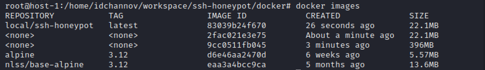

    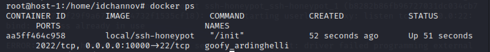

    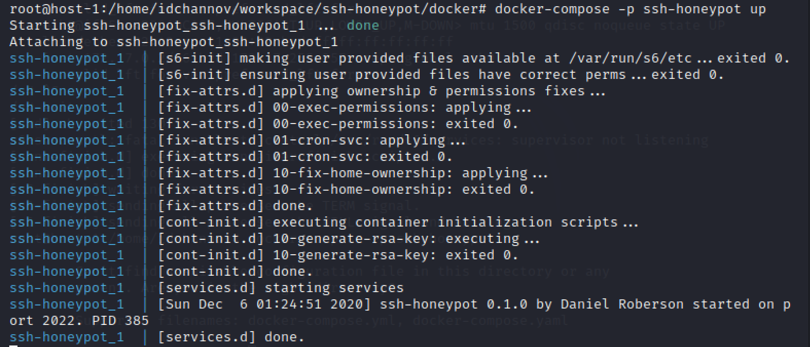


- **中等交互型蜜罐搭建** 👉Cowrie

    ```
    # 拉取crowie镜像
    docker pull cowrie/cowrie
    # 启动容器
    docker run -p 2222:2222 cowrie/cowrie
    ```

    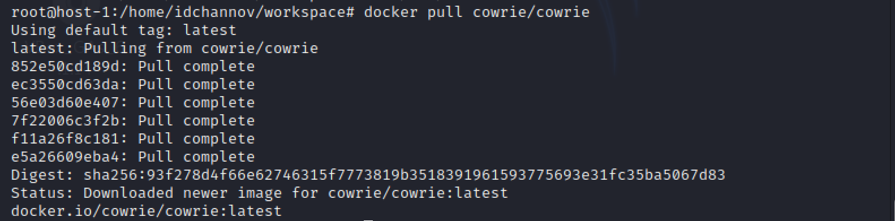

    - 普通用户

        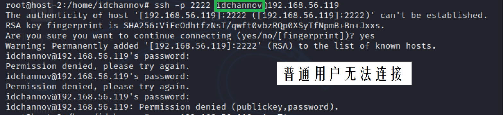

        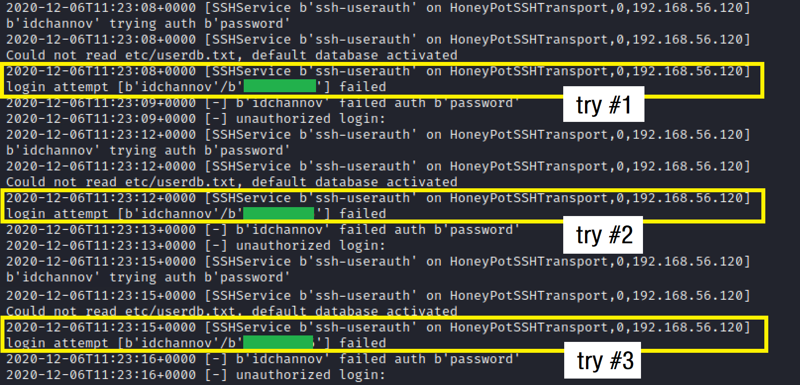

    - root

        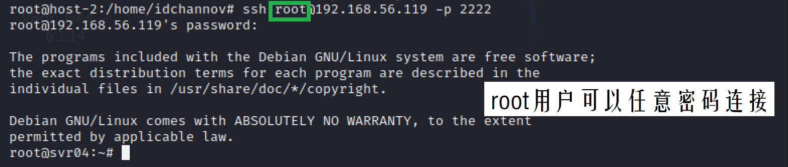

        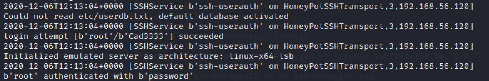


- **基于nmap的蜜罐扫描**

    ```
    # 对host-1进行暴力扫描
    nmap 192.168.56.119 -A -T4 -n -vv
    ```

    - **SSH Honeypot**
    
        本地日志中未出现相关记录

        

    - **Cowrie**

        - host-1终端输出可疑攻击目标的IP、扫描方式、扫描对象、使用端口等信息

        - 日志中记录了攻击者行为

        

- **蜜罐识别与检测**

    - 常见的蜜罐识别和检测方法总结

        - 靶机过“新”，引诱目的过于明显

            【例】文件名/文件夹名设置为sensitive，并放在很容易发现的地方

        - 硬件信息出现异常

            【例】鼠标驱动程序的制造商标记为“ Microsoft SMS解决方案”；CPUID操作码将EAX的值置为0x02

        - 创建不符合实际情况的配置，但机器仍然可以正常运行

            【例】同时运行Windows web server与Unix FTP server

        - 争夺资源后蜜罐机会明显变慢

            【例】启动一个CPU密集型进程；ping flood

        - 根据直接反映基础服务器状态的信息进行判断
            【例】TCP时间戳无始终偏差

        - 网络信息交互中的异常行为（通常由于软件编写错误）

            【例】由于Honeyd处理NMAP指纹信息的错误导致了它在回复TCP数据包时同时设置了SYN和RST标志

        - 可疑的开放网络端口/网络端口组合

            【例】Kuang2留下的后门端口为TCP-17300（不常见端口）

        - 使用蜜罐检测工具

    - 蜜罐识别与检测实操

        **【注】** 由于存在的问题很多，因此这里不进行穷举

        - 低交互型蜜罐：无法使用SSH远程登陆

        - 中等交互型蜜罐 👉 以Cowrie为例

            1. 使用root与任意密码即可实现登录

            2. 使用ssh远程登陆有时限限制

                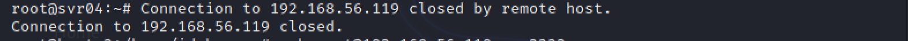

            3. 在蜜罐中对自己的IP实施ping flood

                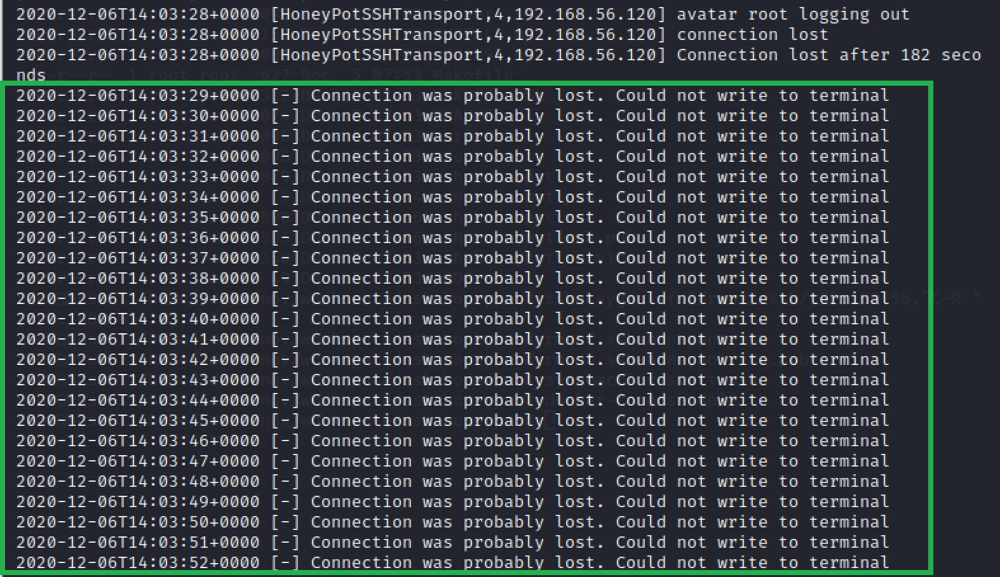

                

            4. 软件安装行为异常

                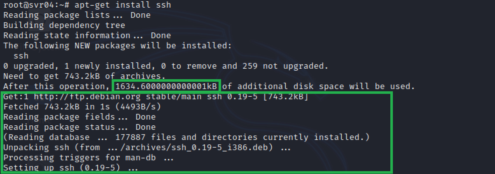
                
                以下是在虚拟机中操作的正常版本：

                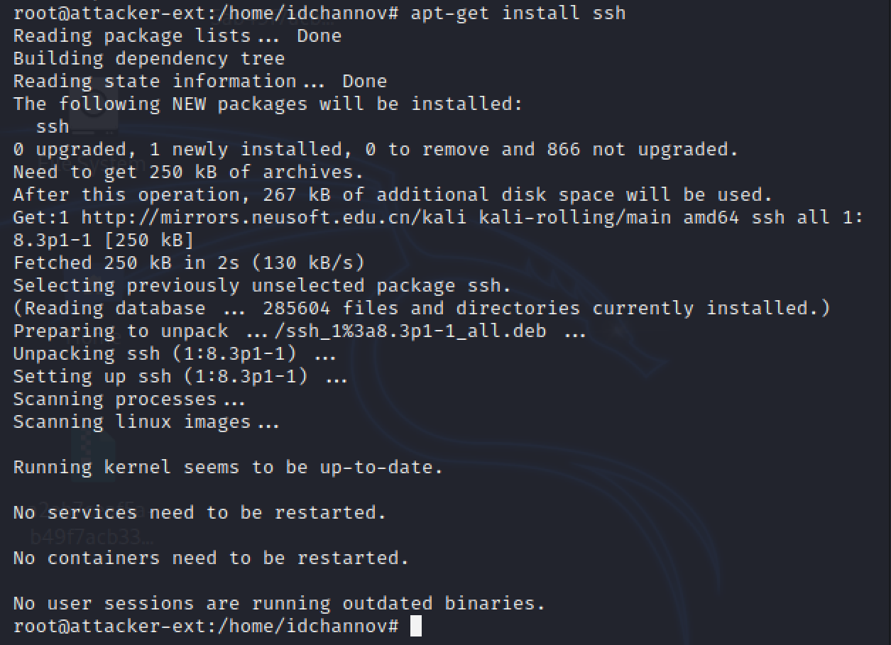

            5. 软件行为模拟异常

                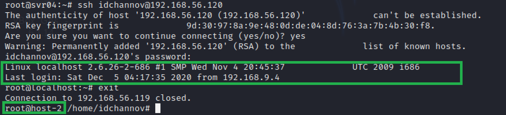

            6. 操作权限异常

                

            7. 用户切换操作无效

                
            
            8. IP地址与ssh连接时使用的IP（192.168.56.119）无法对应

                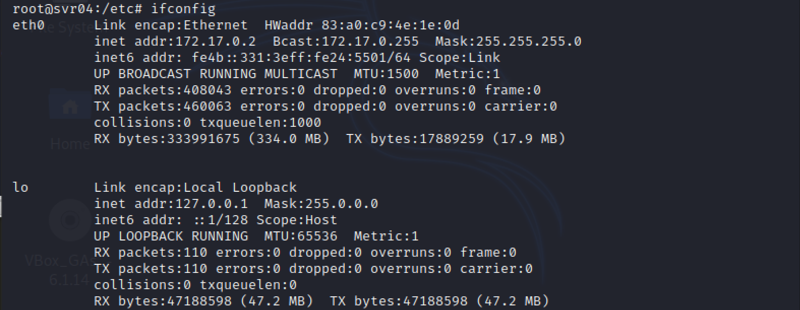

            9. 文件操作异常

                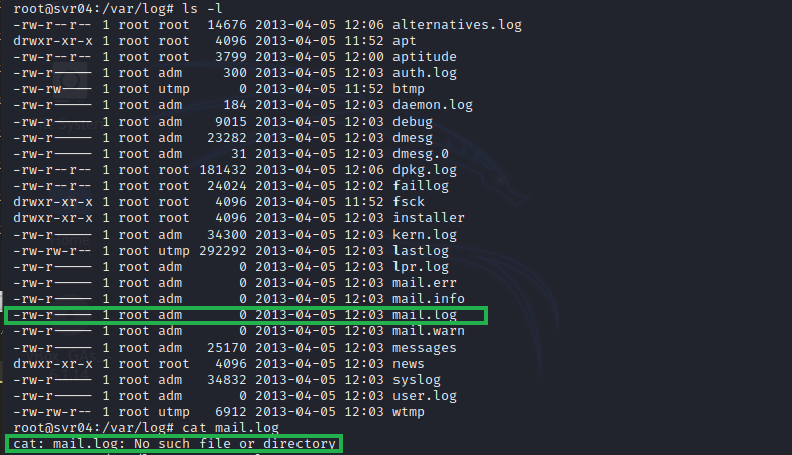

### 6. 遇到的问题

- SSH Honey容器启动失败

    **错误原因：** sshd默认在22端口运行

    **解决方法：** 编辑sshd的配置文件，修改运行端口

    /etc/ssh/sshd_config
    
    ```
    Port unused_port_num
    ```

- **【Unsolved】** SSH Honey服务成功启动，host-2也可以与host-1进行ssh连接，但SSH Honey的日志中无SSH连接的记录

### 7. 参考资料

- [【Low Interaction】droberson/ssh-honeypot - GitHub](https://github.com/droberson/ssh-honeypot)

- [Using "make" and writing Makefiles](https://www.cs.oberlin.edu/~kuperman/help/make.html)

- [SSH Honeypot Docker](https://github.com/droberson/ssh-honeypot/blob/master/docker/README.md)

- [OCI runtime exec failed: exec failed: ...executable file not found in $PATH": unknown](https://stackoverflow.com/questions/48001082/oci-runtime-exec-failed-exec-failed-executable-file-not-found-in-path)

- [Brief Experiment With SSH Honeypots](https://dmfrsecurity.com/2016/12/29/brief-experiment-with-ssh-honeypots/)

- [9. Detecting Honeypots](http://books.gigatux.nl/mirror/honeypot/final/ch09.html)

- [解决unknown import path "golang.org/x/sys/unix": unrecognized import path "golang.org/x/sys"](https://www.cnblogs.com/sage-blog/p/10640947.html)

- [Is it possible to detect a honeypot? [closed]](https://security.stackexchange.com/questions/90642/is-it-possible-to-detect-a-honeypot)