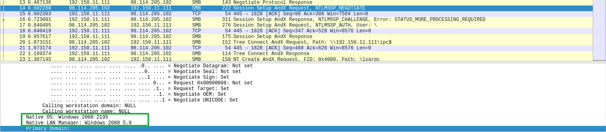
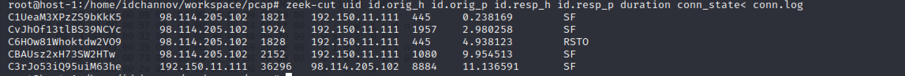

# Exp-0C 基于Zeek的取证分析

### 1. 实验目的

- [x] 了解计算机取证的基本原理与实现方法

### 2. 实验要求

- [x] 使用 zeek 自动化分析 pcap 文件

    - [课件内配套案例：pcap attack trace实验使用的pcap包下载](elem/attack-trace.pcap)

### 3. 实验环境

- 软件环境

    - Kali - SMP Debian 5.7.6-1kali2 (2020-07-01) x86_64 GNU/Linux

    - Zeek - 3.3.0-dev.630

        

### 4. 实验过程

- **Zeek的安装与配置**

    ```
    :==========INSTALLATION==========:
    # 查看系统默认使用的python版本
    python --version
    # 如果系统使用的 Python 版本是 2.x
    apt update && apt-get install cmake make gcc g++ flex bison libpcap-dev libssl-dev python-dev swig zlib1g-dev python-ipaddress  
    # 如果系统使用的 Python 版本是 3.x（✔）
    # apt update && apt-get install cmake make gcc g++ flex bison libpcap-dev libssl-dev python-dev swig zlib1g-dev
    # clone zeek/zeek 到本地
    git clone --recursive https://github.com/zeek/zeek
    # 切换工作目录
    cd zeek
    # 生成构建脚本
    ./configure
    # 构建成功后安装到构建脚本默认指定路径 /usr/local/zeek
    make && make install
    # 将 zeek 可执行文件目录添加到当前用户的 PATH 环境变量
    if [[ $(grep -c '/usr/local/zeek/bin' ~/.bashrc) -eq 0 ]];then echo 'export PATH=/usr/local/zeek/bin:$PATH' >> ~/.bashrc;fi
    # 重新读取 ~/.bashrc 以使环境变量设置即时生效
    source ~/.bashrc

    :==========CONFIGURATION==========:
    vim /usr/local/zeek/share/zeek/site/local.zeek
    vim /usr/local/zeek/share/zeek/site/mytuning.zeek
    ```

    **/usr/local/zeek/share/zeek/site/local.zeek**

    ```
    # add
    @load frameworks/files/extract-all-files
    @load mytuning.zeek
    ```

    **/usr/local/zeek/share/zeek/site/mytuning.zeek**

    ```
    redef ignore_checksums = T;
    # 定义本地网络 IP 地址范围
    # 添加此行变量定义后的变化：
    # 1. 使Zeek运行过程中不产生警告信息
    # 2. 新增2个日志文件，日志中会记录在当前流量（数据包文件）中发现了本地网络IP和该IP关联的已知服务信息
    redef Site::local_nets = { 192.168.56.0/24 };
    ```

    

    

- **可疑文件排查**

    ```
    # 自动化分析
    zeek -r dir_of_pcap /usr/local/zeek/share/zeek/site/local.zeek
    # 切换工作目录
    cd dir_of_pcap
    # 排查当前目录下所有文件，在extract_files目录下发现可疑代码
    file extract_files/extract-1240198114.648099-FTP_DATA-FutkFK231QTWleGBs9
    ```

    

    

    将可疑文件上传至[VirusTotal](https://www.virustotal.com/gui/)，发现扫描结果匹配到了一份[历史扫描报告](https://www.virustotal.com/gui/file/b14ccb3786af7553f7c251623499a7fe67974dde69d3dffd65733871cddf6b6d/detection)，由此可以确定该可疑代码为一个已知的后门程序

    

- **Forensic Challenge 2010 - Challenge 1**

    - Which systems (i.e. IP addresses) are involved?

        **【ANS】**

        - attacker: 98.114.205.102

        - victim: 192.150.11.111

        

    - What can you find out about the attacking host (e.g., where is it located)?

        **【ANS】**

        

        

        

        

    - How many TCP sessions are contained in the dump file?

        **【ANS】**

        5

        

    - How long did it take to perform the attack?

        **【ANS】**

        9.954513 sec （不确定单位是不是sec，Con::Info中没有说明

        

    - Which operating system was targeted by the attack? And which service? Which vulnerability?

        **【ANS】**

        - OS: Windows 5.1

            

    （剩下的不会了qwq……希望变强以后可以一步一步做出来

### 5. 遇到的问题

- 在extract_files目录下没有发现后门程序

    **错误原因：** attack-trace.pcap放在共享文件夹中，因此后门程序会被Microsoft Defender系统直接清除（我直接大喊一句微软牛逼！

    

    

### 6. 参考资料

- [Zeek : A Powerful Network Analysis Framework](https://kalilinuxtutorials.com/zeek-powerful-network-analysis-framework/)

- [base/init-bare.zeek — Zeek User Manual v3.2.2docs](https://docs.zeek.org/en/current/scripts/base/init-bare.zeek.html)

- [Log Files — Zeek User Manual v3.2.2](https://docs.zeek.org/en/current/script-reference/log-files.html)

- [CHALLENGE 1 OF THE FORENSIC CHALLENGE 2010 – PCAP ATTACK TRACE](https://www.honeynet.org/challenges/challenge-1-of-the-forensic-challenge-2010-pcap-attack-trace/)